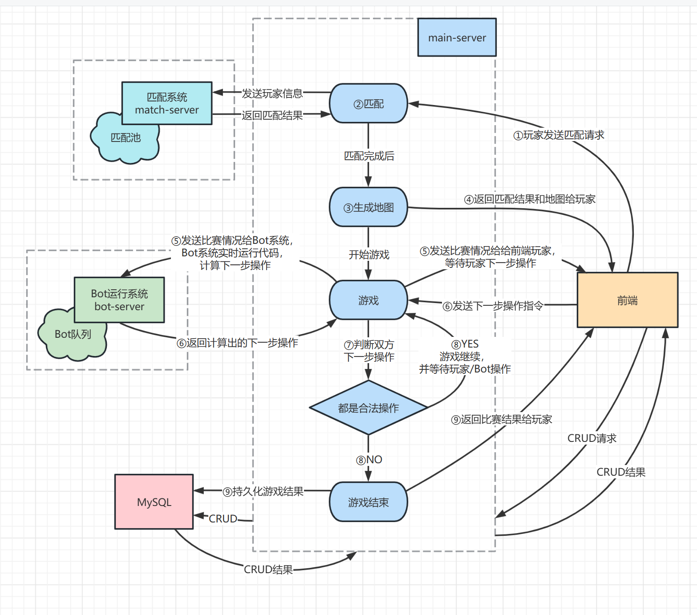
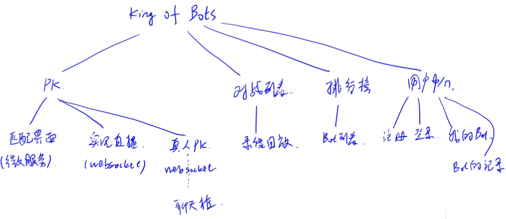

# King of bots
基于SpringBoot的AI对战平台
## 项目结构

### 实现模块
* 用户中心
  * 注册
  * 登录
  * 我的Bot
  * Bot的记录
* PK
  * 匹配界面（微服务）
  * 实况（websocket）
  * 真人PK（websocket）
  * Bot代码执行（微服务）
* 对战列表
  * 录像回放
* 排行榜
### 项目功能

### 项目笔记
[1、工具](笔记/工具.md)

[2、注册登录模块](笔记/注册登录模块.md)

[3、创建个人中心页面](笔记/创建个人中心页面.md)

[4、创建菜单与游戏界面](笔记/创建菜单与游戏界面.md)

[5、实现微服务: 匹配系统](笔记/实现微服务：匹配系统.md)

[6、实现微服务: Bot代码的执行](笔记/实现微服务：Bot代码的执行.md)

[7、实现对局记录与排行榜页面](笔记/实现对局记录与排行榜页面.md)
