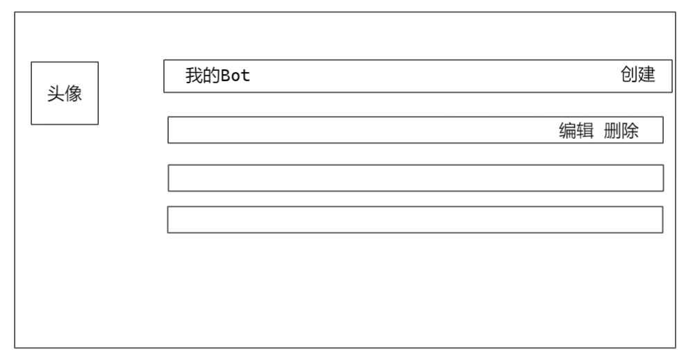
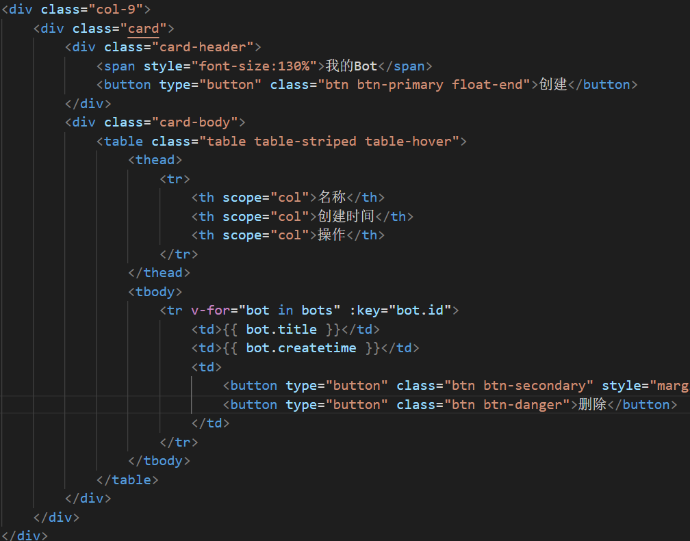
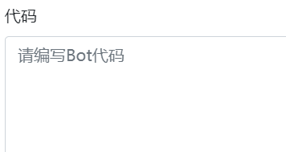

## 数据库

在数据库中创建表`bot`
表中包含的列：

- `id: int`：非空、自动增加、唯一、主键
- `user_id: int`：非空，用于表示`bot`的作者
  - 注意：在pojo中需要定义成`userId`，也就是驼峰命名；在`queryWrapper`中的名称仍然为`user_id`
- `title: varchar(100)`
- `description: varchar(300)`
- `content：varchar(10000)`，对应的`bot`的代码
- `rating: int`：默认值为1500
- `createtime: datetime`
  - `pojo`中定义日期格式的注解：`@JsonFormat(pattern = "yyyy-MM-dd HH:mm:ss")`
- `modifytime`: `datetime`
  - `pojo`中定义日期格式的注解：`@JsonFormat(pattern = "yyyy-MM-dd HH:mm:ss")`

## Pojo

`backend/pojo`中.java创建对应的`Bot.java`，将表中的内容映射成`class`

```java
@Data
@NoArgsConstructor
@AllArgsConstructor
public class Bot {
    @TableId(type = IdType.AUTO)
    private Integer id;
    private Integer userId;
    private String title;
    private String description;
    private String content;
    private Integer rating;
    @JsonFormat(pattern = "yyyy-MM-dd HH:mm:ss")
    private Date createtime;
    @JsonFormat(pattern = "yyyy-MM-dd HH:mm:ss")
    private Date modifytime;
}
```

## mapper

创建`backend/mapper/BotMapper.java`

```java
@Mapper
public interface BotMapper extends BaseMapper<User> {
}
```

## 后端API

接下来就需要实现有关增删改查的四个后端`api`

- `/user/bot/add/`：创建一个`Bot`
- `/user/bot/remove/`：删除一个`Bot`
- `/user/bot/update/`：修改一个`Bot`
- `/user/bot/getlist/`：查询`Bot`列表

对于后端api，总共需要实现三个地方，service，service.impl和controller

### service

1）`service.user.bot.AddService.java`

```java
public interface AddService {
    Map<String, String> add (Map<String, String> data);
}
```

2）`service.user.bot.RemoveService.java`

```java
public interface RemoveService {
    Map<String, String> remove(Map<String, String> data);
}
```

3）`service.user.bot.UpdateService.java`

```java
public interface UpdateService {
    Map<String, String> update (Map <String, String> data);
}
```

4）`service.user.bot.GetListService.java`

```java
public interface GetListService {
    //查询当前用户的bot
    List<Bot> getlist();//由于当前用户的user id保存在token中 因此不用传参数
}
```

### service.impl

1）`service.impl.user.bot.AddServiceImpl.java`

```java
@Service
public class AddServiceImpl  implements AddService {
    @Autowired
    private BotMapper botMapper;//注入接口

    @Override
    public Map<String, String> add(Map<String, String> data) {
        //1. 获取User
        //同InfoServiceImpl一样 如果授权成功 则从上下文中将User信息提取出来
        UsernamePasswordAuthenticationToken authenticationToken =
                (UsernamePasswordAuthenticationToken) SecurityContextHolder.getContext().getAuthentication();
        UserDetailsImpl loginUser = (UserDetailsImpl) authenticationToken.getPrincipal();
        User user = loginUser.getUser();

        //2. 获取data内容
        String title = data.get("title");
        String description = data.get("description");
        String content = data.get("content");

        Map<String,String> map = new HashMap<>();//定义return格式

        //语法检查
        if(title == null || title.length() == 0){
            map.put("error_message","标题不能为空");
            return map;
        }
        if(title.length() > 100){
            map.put("error_message","标题长度不能大于100");
            return map;
        }
        if(description == null || description.length() == 0){
            description = "这个用户很懒，什么也没有留下";
        }
        if(description.length() > 300){
            map.put("error_message","Bot描述的长度不能大于300");
            return map;
        }
        if(content == null || content.length() == 0){
            map.put("error_message","代码不能为空");
            return map;
        }
        if(content.length() > 10000){
            map.put("error_message","代码长度不能大于10000");
            return map;
        }

        //3. 创建Bot对象
        Date now = new Date();
        //id自增 因此不用传
        //创建时间和修改时间一致
        Bot bot = new Bot(null, user.getId(), title, description, content, 1500, now, now);
        botMapper.insert(bot);
        map.put("error_message","success");
        return map;
    }
}
```

2）`service.impl.user.bot.RemoveServiceImpl.java`

```java
@Service
public class RemoveServiceImpl implements RemoveService {
    @Autowired
    private BotMapper botMapper;
    @Override
    public Map<String, String> remove(Map<String, String> data) {

        //1.获取当前User
        UsernamePasswordAuthenticationToken authenticationToken =
                (UsernamePasswordAuthenticationToken) SecurityContextHolder.getContext().getAuthentication();
        UserDetailsImpl loginUser = (UserDetailsImpl) authenticationToken.getPrincipal();
        User user = loginUser.getUser();
        //2.获取bot
        int bot_id = Integer.parseInt(data.get("bot_id"));
        Bot bot = botMapper.selectById(bot_id);

        Map<String, String> map = new HashMap<>();

        //3.判断条件
        if(bot == null){
            map.put("error_message","Bot不存在或已被删除");
            return map;
        }
        if(!bot.getUserId().equals(user.getId())){//比较数字对象用equals
            map.put("error_message","没有权限删除该Bot");
            return map;
        }

        botMapper.deleteById(bot_id);
        map.put("error_message","success");
        return map;
    }
}
```

3)`service.impl.user.bot.UpdateServiceImpl.java`

```java
@Service
public class UpdateServiceImpl implements UpdateService {
    @Autowired
    private BotMapper botMapper;
    @Override
    public Map<String, String> update(Map<String, String> data) {
        //1.获取当前User
        UsernamePasswordAuthenticationToken authenticationToken
                = (UsernamePasswordAuthenticationToken) SecurityContextHolder.getContext().getAuthentication();
        UserDetailsImpl loginUser
                = (UserDetailsImpl) authenticationToken.getPrincipal();
        User user = loginUser.getUser();
        //2.获取属性并检查
        String title = data.get("title");
        String description = data.get("description");
        String content = data.get("content");
        Date now = new Date();
        //语法检查
        Map<String, String> map = new HashMap<>();
        if(title == null || title.length() == 0){
            map.put("error_message","标题不能为空");
            return map;
        }
        if(title.length() > 100){
            map.put("error_message","标题长度不能大于100");
            return map;
        }
        if(description == null || description.length() == 0){
            description = "这个用户很懒，什么也没有留下";
        }
        if(description.length() > 300){
            map.put("error_message","Bot描述的长度不能大于300");
            return map;
        }
        if(content == null || content.length() == 0){
            map.put("error_message","代码不能为空");
            return map;
        }
        if(content.length() > 10000){
            map.put("error_message","代码长度不能大于10000");
            return map;
        }

        //3.获取bot并更新
        int bot_id = Integer.parseInt(data.get("bot_id"));
        Bot bot = botMapper.selectById(bot_id);
        if(bot == null){
            map.put("error_message","Bot不存在或已删除");
            return map;
        }
        if(!bot.getUserId().equals(user.getId())){
            map.put("error_message", "没有权限修改该Bot");
            return map;
        }
        //注意 id userid不可改 rating不在此处修改
        try{
            bot.setTitle(title);
            bot.setDescription(description);
            bot.setContent(content);
            bot.setModifytime(now);
        }catch(Exception e) {
            System.out.println("更新失败");
        }
        botMapper.updateById(bot);
        map.put("error_message", "success");
        return map;
    }
}
```

4）`service.impl.user.bot.GetListServiceImpl.java`

```java
@Service
public class GetListServiceImpl implements GetListService {
    @Autowired
    private BotMapper botMapper;

    @Override
    public List<Bot> getlist() {
        //1.获取用户
        UsernamePasswordAuthenticationToken authenticationToken =
                (UsernamePasswordAuthenticationToken) SecurityContextHolder.getContext().getAuthentication();
        UserDetailsImpl loginUser = (UserDetailsImpl) authenticationToken.getPrincipal();
        User user = loginUser.getUser();
        //2.查询当前用户下的所有Bot
        QueryWrapper<Bot> queryWrapper = new QueryWrapper();
        queryWrapper.eq("user_id",user.getId());
        List<Bot> bots = botMapper.selectList(queryWrapper);
        return bots;
    }
}
```

### controller

1）`controller.user.bot.AddController.java`

```java
@RestController
public class AddController {
    @Autowired
    private AddService addService;//将AddService接口注入

    @PostMapping("/user/bot/add/") //处理涉及修改数据库的请求 用Post
    public Map<String, String> add (@RequestParam Map<String,String> data){
        return addService.add(data);
    }
}
```

测试：

在`views\user\bot\UserBotIndexView.vue`中创建如下代码：


使用`zhou`进行登录，对应的`userID`为7


2）`controller.user.bot.RemoveController.java`

```java
@RestController
public class RemoveController {
    @Autowired
    private RemoveService removeService;

    @PostMapping("/user/bot/remove/")
    public Map<String,String> remove (@RequestParam Map<String, String> data){
        //data中只保存botid的信息
        return removeService.remove(data);
    }
}
```

3）`controller.user.bot.UpdateController.java`

```java
@RestController
public class UpdateController {
    @Autowired
    private UpdateService updateService;

    @PostMapping("/user/bot/update/")
    public Map<String, String> update (@RequestParam Map<String,String> data){
        return updateService.update(data);
    }
}
```

4）`controller.user.bot.GetListController.java`

```java
@RestController
public class GetListController {
    @Autowired
    private GetListService getListService;
    @GetMapping("/user/bot/getlist")
    public List<Bot> getlist (){
        return getListService.getlist();
    }
}
```

## 前端实现

接下来实现“我的Bot”页面

在个人中心页面，要能对Bot进行增删改查



### 展示列表

依然是使用Grid system进行布局，Grid system将一行分成12份，我们设置头像占3份，其余占9份

```html
<template>
    <div class="container">
        <div class="row">
            <div class="col-3">
                <div class="card">
                    <div class="card-body">
                        
                    </div>
                </div>
            </div>
            <div class="col-9">
                <div class="card">
                    <div class="card-header">
                    <span style="font-size:130%">我的Bot</span>
                    <button type="button" class="btn btn-primary float-end">创建</button>
                    </div>
                    <div class="card-body"></div>
                </div>
            </div>
        </div>
    </div>
</template>
<style scoped>
div.card{
    margin-top: 20px;
}
</style>
```

样式如下：


现在需要显示bot列表，就需要通过Ajax来请求后端的api：`/user/bot/getlist/`


然后将获取到的bots渲染到前端

首先添加一个表格样式：




此时，前端就将后端数据库中的结果遍历出来（当前登录的是7号用户）


### 创建Bot

设想是点击创建之后，可以有一个悬浮窗，我们在悬浮窗中创建。

用到Bootstrap的Modal组件


使用其中一个demo进行修改


效果如下：


现在需要继续在里面添加Form表单


效果如下：


在`script`中，借助`reactive`定义一个`Bot`对象

```js
import { reactive } from 'vue'
// 定义一个Bot对象
const botadd = reactive({
    title:"",
    description:"",
    content:"",
    error_message:"",
});
```

并在前端通过`v-model`将输入的内容与对象的属性绑定

在点击创建的时候，触发`add_bot`函数，定义如下：

```js
//定义函数——创建bot
const add_bot = () =>{
    botadd.error_message = "";
    $.ajax({
        url:"http://localhost:3000/user/bot/add/",
        type:"post",
        data:{
            title:botadd.title,
            description:botadd.description,
            content:botadd.content,
        },
        headers:{
            Authorization:"Bearer " + store.state.user.token,
        },
        success(resp){
            if(resp.error_message === "success"){
                refresh_bots();
            }else{
                botadd.error_message = resp.error_message;
            }
        }
    })
}
```

注意：凡是没有放行的url，也就是需要确保登录正常才能访问，在提交请求的时候，必须要添加授权验证信息：

```JS
headers:{
            Authorization:"Bearer " + store.state.user.token,
        },
```

目前只有登录和注册页面放行：


只有对这两个url发起的请求不需要添加`headers`

在点击“创建”按钮，触发`add_bot`事件

```html
 <button type="button" class="btn btn-primary" @click="add_bot">创建</button
```


测试成功。


优化：创建之后

* 自动关闭悬浮窗
* 清空表单中的内容


另外有个问题时间不一致：


在`Pojo`中修改时区，然后重启项目即可。


### 删除Bot

定义`remove_bot`函数，注意带有参数

```JS
 //定义函数——删除Bot
const remove_bot = (bot)=>{
    $.ajax({
        url:"http://localhost:3000/user/bot/remove/",
        type:"post",
        headers:{
            Authorization:"Bearer " + store.state.user.token,
        },
        data:{
            bot_id:bot.id
        },
        success(resp){
            if(resp.error_message == "success"){
                console.log("删除成功");
                refresh_bots();
            }else{
                alert(resp.error_message)
            }
        }
    })
}
```

前端通过`@click`绑定事件

```vue
<tbody>
    <tr v-for="bot in bots" :key="bot.id">
        <td>{{ bot.title }}</td>
        <td>{{ bot.createtime }}</td>
        <td>
            <button type="button" class="btn btn-secondary"
                    style="margin-right:10px">修改</button>
            <button type="button" class="btn btn-danger" @click="remove_bot(bot)">删除</button>
        </td>
    </tr>
</tbody>
```

### 修改Bot

修改的逻辑和添加基本一致

```js
//定义函数——修改bot
const update_bot = (bot) => {
    bot.error_message = "";
    $.ajax({
        url: "http://localhost:3000/user/bot/update/",
        type: "post",
        data: {
            bot_id:bot.id,
            title: bot.title,
            description: bot.description,
            content: bot.content,
        },
        headers: {
            Authorization: "Bearer " + store.state.user.token,
        },
        success(resp) {
            if (resp.error_message === "success") {
                Modal.getInstance('#update-bot-btn-' + bot.id).hide();
                alert("修改成功");
                refresh_bots();
            } else {
                bot.error_message = resp.error_message;
            }
        }
    })
}
```

在前端，需要将每一个`bot`对应的`Modal`框都不一样，因此需要添加一个id字段


每一个`bot`与每一个模态框绑定起来，这样点击对应的bot之后，在`Modal`框中展示出相应的的内容


否则的话，不管点击哪个`bot`，因为只有一个`Modal`框，展示的都只是第一个`bot`的内容！

### 代码编辑器

希望将编写代码的区域换成代码编辑器



在`vue`控制台安装依赖：`vue3-ace-editor`


解决方法是，使用管理员打开`powershell`


集成依赖，并将其注册为VUE选项的组件

```Js
import { VAceEditor } from 'vue3-ace-editor';
import ace from 'ace-builds';

export default {
    data,
    methods,
    ...
    components: {
        VAceEditor,
    },
}
```

在`setup`中添加

```Js
ace.config.set(
    "basePath", 
    "https://cdn.jsdelivr.net/npm/ace-builds@" + require('ace-builds').version + "/src-noconflict/")
```

然后用下面这段代码替换代码区域

(对于修改而言，是`v-model:value="bot.content"`)

```html
<VAceEditor
    v-model:value="botadd.content"
    @init="editorInit"
    lang="c_cpp"
    theme="textmate"
    style="height: 300px" />
```

实现效果

