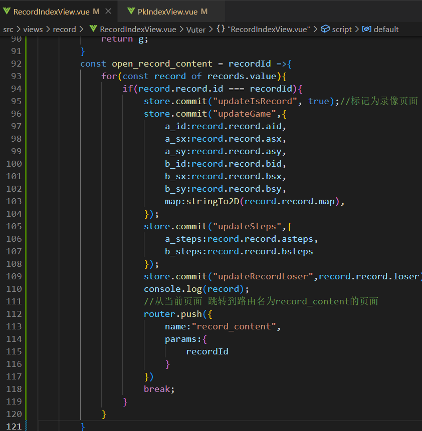
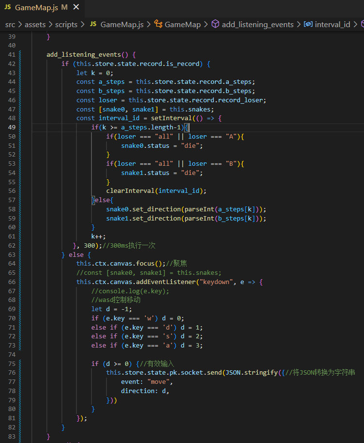

这部分的代码实现均在backend端。

## 天梯积分更新

随着对战的结束，要相应的更新用户的天梯积分


更新代码如下：


## 对局列表

### 后端API

首先实现一个API，从后端返回一个对局列表的List。实现API，需要依次编写service, service.impl, controller。

由于对局列表可能很长，需要添加分页功能。

在`config.MybatisConfig`中添加分页配置：

```java
@Configuration
public class MybatisConfig {
    @Bean
    public MybatisPlusInterceptor mybatisPlusInterceptor() {
        MybatisPlusInterceptor interceptor = new MybatisPlusInterceptor();
        interceptor.addInnerInterceptor(new PaginationInnerInterceptor(DbType.MYSQL));
        return interceptor;
    }
}
```

在`service.record`中创建`GetRecordListService`

不需要将所有页面的信息均返回出来，用户需要展示第几页，就对应的返回第几页。

```java
public interface GetRecordListService {
    JSONObject getList (Integer page);//page表示页号 只需要返回对应页号的list
}
```

在`service.impl.record`中创建`GetRecordListServiceImpl`

假定每页展示10条信息，所以如果page = 1，返回0~9条；page = 2，返回10~19条

直接借助mabatisplus中的工具IPage实现即可。

```java
@Service
public class GetRecordListServiceImpl implements GetRecordListService {
    @Autowired
    private RecordMapper recordMapper;
    @Autowired
    private UserMapper userMapper;
    @Override
    public JSONObject getList(Integer page) {
        IPage<Record> recordIPage = new Page<>(page, 10);//每页size为10
        QueryWrapper<Record> queryWrapper = new QueryWrapper<>();
        queryWrapper.orderByDesc("id");//按照id逆序排序
        //将record按照ID逆序排序，并返回第page页的内容
        List<Record> records = recordMapper.selectPage(recordIPage, queryWrapper).getRecords();
        JSONObject resp = new JSONObject();//用于返回到前端
        List<JSONObject> items = new LinkedList<>();
        for(Record record : records){
            //存储对战双方的用户名 用户头像
            User userA = userMapper.selectById(record.getAId());
            User userB = userMapper.selectById(record.getBId());
            JSONObject item = new JSONObject();
            item.put("a_photo", userA.getPhoto());
            item.put("a_username", userA.getUsername());
            item.put("b_photo", userB.getPhoto());
            item.put("b_username", userB.getUsername());
            String result = "平局";
            if("A".equals(record.getLoser())) result = "B胜";
            else if("B".equals(record.getLoser())) result = "A胜";
            item.put("result", result);
            item.put("record", record);
            items.add(item);
        }
        resp.put("records", items);
        resp.put("records_count", recordMapper.selectCount(null));

        return resp;
    }
}
```

在`controller.record`中创建`GetRecordListController`

```java
@RestController
public class GetRecordListController {
    @Autowired
    private GetRecordListService getRecordListService;

    @GetMapping("/record/getlist/")
    private JSONObject getList (@RequestParam Map<String, String> data){
       Integer page =  Integer.parseInt(data.get("page"));
       return getRecordListService.getList(page);
    }
}
```

### 前端展示

#### 获取列表

在`RecordIndexView.vue`中，请求获取对局记录。


测试如下：

与后端返回的格式一致，结果分两大部分records和records_count


其中records.records又包括


接下来要将列表显示出来。

需要建立一个tabel，遍历records将内容展示出来


效果如下：

#### 查看录像

为了方便展示录像，需要存储一些全局信息，包括是否展示录像，以及a和b的steps

`record.js`


同时，点击查看录像，需要进入一个新的页面，建立一个新的vue页面`src\views\record\RecordContentView.vue`

由于录像页面，和PK页面实际上大部分内容相同，因此，直接将PK页面的内容复制过来加以修改。

这里只需要用到`PlayGround`这一个组件，初始化为。


并将这样一个页面，加入路由

注意，路由中，`path`可以加入参数，这里`recordId`就是传入的参数

```js
import RecordContentView from '../views/record/RecordContentView.vue'
const routes = [
  {
    path:"/record/:recordId",
    name:"record_content",
    component:RecordContentView,
    meta:{
      requestAuth:true,
    }
  ]
```

回到`src\views\record\RecordIndexView.vue`

点击查看录像按钮时，触发`open_record_content`，并且传入记录的ID


在`open_record_content`函数中，需要通过`updateIsrecord`来标记为录像页面；

同时注意，在对战页面的vue页面中，取消标记


在`open_record_content`函数中同时调用`updateGame`，对游戏进行更新，调用`updateSteps`，更新`a_step`和`b_step`，调用`updateRecordLoser`，更新`record_loser`



同时需要在Gamemap.js中添加一些逻辑判断。

因为不管是对战页面，还是录像页面，都共用了`PlayGround`组件

对于`PlayGround`组件，由`GameMap`组件构成


在GameMap中要创建GameMap类的实例


因此，不管是对战页面还是录像页面，都需要`GameMap.js`中执行相应的逻辑

这里需要在`GameMap.js`中判断是录像是否被标记，如果没有标记，就依然是之前对战的逻辑。

#### 操作回放

如果录像被标记，也就是`this.store.state.record.is_record`为true。

录像本质上是操作的回放，只需要根据两名玩家的steps，重新将蛇移动一遍。



这样，就实现了对局录像的展示。

#### 分页展示

借助Bootstrap的Pagination组件


```html
<nav aria-label="...">
  <ul class="pagination">
    <li class="page-item disabled">
      <span class="page-link">Previous</span>
    </li>
    <li class="page-item"><a class="page-link" href="#">1</a></li>
    <li class="page-item active" aria-current="page">
      <span class="page-link">2</span>
    </li>
    <li class="page-item"><a class="page-link" href="#">3</a></li>
    <li class="page-item">
      <a class="page-link" href="#">Next</a>
    </li>
  </ul>
</nav>
```

加入到vue页面中去，效果如下：


被`active`标记的数字变蓝

我们的需求是，展示当前页，并且在分页栏中留出前后两页。


此时结果符合预期


并且，还需要点击哪个按钮，就要跳转到对应的页面。


分页功能成功实现！

## 排行榜

### 后端API


### 前端展示

在对局页面`src\views\record\RecordIndexView.vue`逻辑一致，因此，代码复用率很高

主要就是将records和total_records改为users和total_users，修改非常少量的代码

```vue
<template>
    <ContentFieldVue>
        <table class="table table-striped table-hover" style="text-align:center">
            <thead>
                <tr>
                    <th>玩家</th>
                    <th>天梯积分</th>
                </tr>
            </thead>
            <tbody>
                <tr v-for="user in users" :key="user.id">
                    <td>
                        
                        &nbsp;
                        <span class="ranklist-user-username"> {{ user.username }}</span>
                    </td>
                    <td>
                        {{ user.rating }}
                    </td>
                </tr>
            </tbody>
        </table>
        <nav aria-label="...">
            <ul class="pagination" style="float:right">
                <li class="page-item" @click="click_page(-2)">
                    <a class="page-link" href="#" >前一页</a>
                </li>
                <li :class="'page-item ' + page.is_active" 
                    v-for="page in pages" :key="page.pageId" @click="click_page(page.pageId)">
                    <a class="page-link" href="#">{{page.pageId}}</a>
                </li>
                <li class="page-item" @click="click_page(-1)">
                    <a class="page-link" href="#">后一页</a>
                </li>
            </ul>
        </nav>
    </ContentFieldVue>
</template>
<script>
import ContentFieldVue from '../../components/ContentField.vue'
import { useStore } from 'vuex';
import $ from 'jquery'
import { ref } from 'vue';
export default {
    components: {
        ContentFieldVue
    },
    setup() {
        const store = useStore();
        let current_page = 1;
        let users = ref([]);
        let total_users = 0;
        let pages = ref([]);
        const click_page = page => {
            if(page === -2)
                page = current_page - 1;
            if(page === -1)
                page = current_page + 1;
            let max_pages = parseInt(Math.ceil(total_users / 3));
            if(page >= 1 && page <= max_pages){
                pull_page(page);//加载一个新的分页
            }
        }
        const update_pages = () =>{
            let max_pages = parseInt(Math.ceil(total_users / 3));//最大页数
            let new_pages = [];
            for(let i = current_page - 2; i <= current_page + 2; i++){
                if(i >= 1 && i <= max_pages){
                    new_pages.push({
                        pageId:i,
                        is_active:i === current_page ? "active" : ""
                    });
                }
            }   
            pages.value = new_pages;
        }

        const pull_page = page => {
            current_page = page;
            $.ajax({
                url: "http://127.0.0.1:3000/ranklist/getlist/",
                data: {
                    page,
                },
                type: "get",
                headers: {
                    Authorization: "Bearer " + store.state.user.token,
                },
                success(resp) {
                    console.log(resp);
                    users.value = resp.users;
                    total_users = resp.user_count;
                    update_pages();
                },
                error(resp) {
                    console.log(resp);
                }
            })
        }
        pull_page(current_page);

        return {
            users,
            total_users,
            pages,
            click_page
        }
    }
}
</script>
```

此时就可以实现


