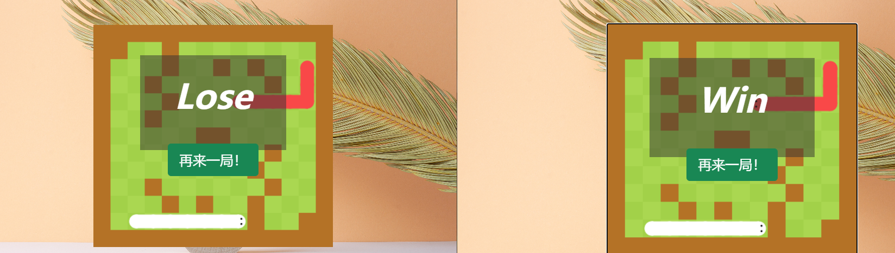
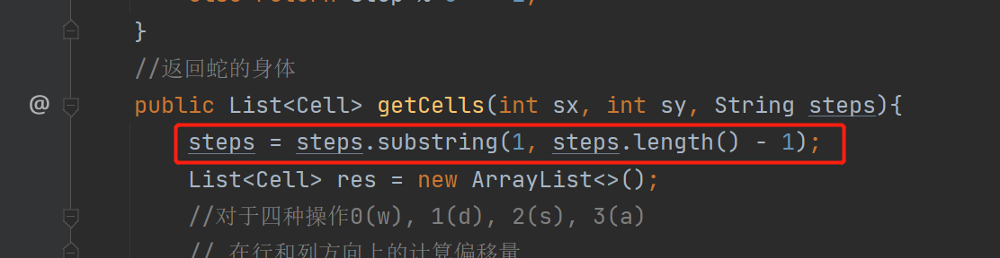

## 流程设计


接下来要实现的是，Bot代码执行的微服务部分。


## 初始化

相应的，首先要创建该服务的后端。


然后将`matchingsystem`模块的依赖直接复制过来

```xml
<dependencies>
        <!--Spring Security-->
        <dependency>
            <groupId>org.springframework.boot</groupId>
            <artifactId>spring-boot-starter-security</artifactId>
            <version>2.7.1</version>
        </dependency>
        <dependency>
            <groupId>org.springframework.boot</groupId>
            <artifactId>spring-boot-starter-web</artifactId>
        </dependency>
        <!--spring-cloud-dependencies-->
        <dependency>
            <groupId>org.springframework.cloud</groupId>
            <artifactId>spring-cloud-dependencies</artifactId>
            <version>2021.0.3</version>
            <type>pom</type>
            <scope>import</scope>
        </dependency>
        <dependency>
            <groupId>org.springframework.boot</groupId>
            <artifactId>spring-boot-starter-test</artifactId>
            <scope>test</scope>
        </dependency>
        <!--Project Lombok-->
        <dependency>
            <groupId>org.projectlombok</groupId>
            <artifactId>lombok</artifactId>
            <version>1.18.24</version>
            <scope>provided</scope>
        </dependency>
    </dependencies>
```

同时在`BotRunningSystem`项目中添加依赖`joor-java-8`([Maven仓库地址](https://mvnrepository.com/))：用于动态的编译和执行代码


为了如果拓展为实现其他语言，可以在云端自动启动一个`docker`容器，来执行其他语言。


重命名：


同时添加`resources/application.properties`文件，写入端口号

```
server.port=3002
```

## 后端API

首先要实现一个后端API，接收Bot代码，并将其加入到Bot运行池

 实现后端API需要加入对应的`controller`， `service`， `service.impl`，以及添加`ResTemplateConfig`，并且在`SecurityConfig`中配置网关。


下面暂时写一些测试性的内容。

`BotRunningService.java`


`BotRunningServiceImpl.java`


`BotRunningController.java`


`RestTemplateConfig.java`


`SecurityConfig.java`，用于配置网关


## 修改前端

前端需要做一些修改，可以选择人工对战还是Bot参与对战。

并且，在client向server发请求时，如果是Bot参与对战，还需要指名bot_id

需要在匹配页面加入一个复选框


在BootStrap中找到相应工具


添加如下：


效果：


然后还需要动态的获取Bot列表，


同样，需要将用户选择了哪个bot告诉前端，引出需要做一个双向数据绑定。


这样将用户的选择与前端的变量就双向绑定了起来。


## 参数传递

然后需要在通信的时候，将user_id作为参数返回，并且后端也要相应的接收参数。


BackEnd端接收


BackEnd端向MatchingSystem端发送


MatchingSystem端接收


同样MatchingSystem端再向Backend端返回结果的时候，也需要发送一个botId


Backend接收参数


这次，整个发送bot_id的流程才算完整。


## 取到Bot信息

`WebSocketServer.java`

1）首先将BotMapper注入

```java
private static BotMapper botMapper;
@Autowired
public void setBotMapper(BotMapper botMapper){
    WebSocketServer.botMapper = botMapper;
}
```

2）借助BotMapper将两个用户选择的bot取出


此时将bot的信息传入了Game中


## Bot or not判断

取到了bot信息，创建完地图之后，在执行nextstep之前，判断botid是否等于-1，如果是-1，就要处理的是用户手动键入的指令，那么就等待用户输入；如果不等于-1，说明参与游戏的是Bot代码，则需要向BotRunningSystem发送消息，使其自动计算，并返回结果。

因此，需要在`nextStep()`中实现上述的判断。


如果是人工输入，则无需操作；如果是Bot参与，需要将用户id，bot代码，以及当前的局面传到`RotRunningSystem`系统的`BotRunningController`


其中，`getInput(Player player)`表示获取当前游戏局面的信息


此外，为了防止人工输入和bot执行混淆，还需要在执行bot的时候，屏蔽掉用户的输入。只有判断用户亲自出马的时候，才接收人的输入。


测试如下：


可以看到，经过了漫长的传递过程，此时`bot`的信息，终于传到了`BotRunningSystem`


## Bot微服务

接下来就是本节的重点，也就是实现Bot Running System微服务。

### 生产者—消费者模式

这部分的工作在于，不断的接收用户的输入，将接收到的代码放在一个队列里面，也就是队列中存储当前所有的任务。每接收一个来自生产者的任务过来，就将其放在队列里。BotPool相当于消费者，每完成一个任务，检查一下队列是否为空，如果队列不空，就从队头取出代码执行。执行完之后继续检查。

MatchingPool中的循环，每循环一次，sleep一秒钟，但BotPool中的循环，为了保证用户体验，需要满足一旦有任务，立即执行。执行完之后，如果队列为空，就继续等待。因此两者循环的实现逻辑不一样，后者用到条件变量。

首先实现消费者线程及其流程。

### 消费者线程

1）如果任务队列为空，就要将其阻塞，当有任务出现时，就要发生信号量，将其唤醒。因此需要用到条件变量。

> 使用`condition.await()`将当前线程阻塞
>
> Causes the current thread to wait until it is signalled or interrupted.
>
> （导致当前线程等待，直到发出信号或中断。）

2）此外还需要队列，来存储`Bot`，定义一个`Bot`类，


并定义一个存储Bot对象的队列`Queue<Bot>`。

> 生产者和消费者都会对`Queue<Bot>`进行操作，因此处理的时候需要加锁。

3）在消费Bot对象之前，一点要先解锁，否则往队列添加Bot对象的时候就会被阻塞，但完全没有必要，因为没有读写冲突。

代码如下：


其中，如果队列为空，线程将会被阻塞。当`addBot()`被调用，队列中添加新的任务时，线程将会被唤醒


BotPool线程的存储，以及关于添加Bot的调用，均放在`BotRunningServiceImpl`中


与匹配系统一样，也是在BootStrap服务启动的时候，启动BotPool线程。


### consum操作

这里只是简单的实现Java代码的编译和执行。后续如果需要添加安全验证或者支持其他语言，只需要修改consum函数即可。对于安全验证，也就是防止程序运行可能产生的危害，可以将其放在沙箱中运行。对于支持其他语言，可以将consum函数改为对docker的执行（Java中执行终端命令，将终端命令的执行放进docker即可）

这里使用Java中的一个工具Joor，可以动态编译和执行Java代码。

为了让整个执行过程时间可控，每执行一段代码，就需要将其放在一个线程中，线程可以支持如果超时就会断掉的操作。新建一个`Consumer`类用于表示这种线程。


然后在`botpool`的`consum`函数中，创建一个`Consumer`对象，并调用对象的`startTimeout`方法。


再回到`Consumer`类的`run()`中，需要使用到`joor.Reflect`类来动态编译执行一段代码


不过这里有个问题，在动态编译过程中，如果是重名的类，只会编译一次。但是对于每一个任务代码，都应该重新编译一遍，因此，需要在类名之前，添加一个随机字符串，来保证类不一样。

下面这段代码，就可以实现从前端动态接收一段代码，并动态编译一遍。


### 测试Bot代码

1）1号玩家的Bot，返回0，表示向上走


2）6号玩家，返回2，表示向下走


解决一个空指针异常


修改依赖


这样，在控制台中就能看到输出结果


表示1号玩家往上移动，6号玩家往下移动。

此时Bot信息就传递到了consumer(Joor)


接下来一步要考虑的，就是将Bot代码执行的结果，返回给3000断开的主后端服务器，最终传到nextstep中


## Bot结果返回

### Backend API

为了接收`consumer`中计算的结果，我们要在主服务器中实现一个新的API。


取出`bot`所对应的玩家`userId`和操作`direction`，然后需要玩家的操作传递到`setNextStep`

参考`WebSocketServer`中的`move`（玩家操作传递到`setNextStep`)


### setNextStep


这样就能实现，用户Bot生成的操作，通过Server传递给Game


现在只需要实现`consumer`动态编译Bot代码的结果返回给主服务器`StartGameController`

### 结果返回

将`RestTemplate`注入通过`@Component`到当前的`Consumer`类


通过`RestTemplate`将结果返回到主服务器（主服务器中的`StartGameController`接收）


此时，整个流程就已经打通，通信过程完成闭环。


### 功能测试


此时测试，两个Bot均可以实现自动执行。注意，先点击匹配的用户在左下角，后点匹配的在右上角。

可以修改使得左边用户返回1，则会一直往右走。


当然，可以实现人机对战，即左边蛇一直往右走（Bot运行）右边的蛇用户控制。



## Bot编写

### 设计过程

Bot代码的编写可以直接在IDEA中实现，之后将其复制到浏览器上。


这里实现一个稍微正常一点的AI，也就是在执行的时候判断上下左右哪一步可以走。

对input进行解码

```java
String[] str = input.split("#");
String map = str[0];// 取出地图
int aSx = Integer.parseInt(str[1]), aSy = Integer.parseInt(str[2]);//取出我方起点坐标
String aSteps = str[3];// 取出我方操作
int bSx = Integer.parseInt(str[4]), bSy = Integer.parseInt(str[5]);//取出对手起点坐标
String bSteps = str[6];// 取出对手操作
```


1）取出地图

```java
// 取出地图
int[][] g = new int[13][14];
int k = 0;
for (int i = 0; i < 13; i++) {
    for (int j = 0; j < 14; j++) {
        if(str[0].charAt(k) == '1')
            g[i][j] = 1;
        k++;
    }
}
```

2）取出两条蛇的路径

直接用之前在`Play.java`中写过的代码即可


```java
//检验当前回合 蛇的长度是否增加
private  boolean check_tail_increasing(int step){
    if(step <= 10) return true;
    else return step % 3 == 1;
}
//返回蛇的身体
public List<Cell> getCells(int sx, int sy, String steps){
    List<Cell> res = new ArrayList<>();
    //对于四种操作0(w), 1(d), 2(s), 3(a)
    // 在行和列方向上的计算偏移量
    int[] dx = {-1, 0, 1, 0};
    int[] dy = {0, 1, 0, -1};
    int x = sx;
    int y = sy;
    int step = 0;//回合数
    char[] snacksteps = steps.toCharArray();
    res.add(new Cell(x,y));//添加起点
    //不断根据steps计算出整个蛇身体
    for (Character d : snacksteps) {
        x += dx[d - '0'];
        y += dy[d - '0'];
        res.add(new Cell(x,y));
        if(!check_tail_increasing(++step)){
            //如果蛇尾不增加 就删掉蛇尾
            res.remove(0);//O(N)
        }
    }
    return res;
}

//取出蛇的轨迹
List<Cell> aCells = getCells(aSx, aSy, aSteps);
List<Cell> bCells = getCells(bSx, bSy, bSteps);

for(Cell c : aCells) g[c.x][c.y] = 1;
for (Cell c : bCells) g[c.x][c.y] = 1;
```

3）判断可行的移动方向

枚举一下上右下左四个方向，一旦发现可以走，就设定移动方向。

```java
// 判断可行的移动方向
// 对于四种方向0(↑), 1(→), 2(↓), 3(←)
// 在行和列方向上的计算偏移量
int[] dx = {-1, 0, 1, 0};
int[] dy = {0, 1, 0, -1};

for (int i = 0; i < 4; i++) {
    int x = aCells.get(aCells.size() - 1).x + dx[i];//下一处x
    int y = aCells.get(aCells.size() - 1).y + dy[i];//下一处y
    if(x >= 0 && x < 13 && y >= 0 && y < 14 && g[x][y] == 0)
        return i;
}
return 0;//如果没有可行的方向 向上走--灭亡
```

### 代码实现

```java
package com.kob.botrunningsystem.utils;

import java.util.ArrayList;
import java.util.List;

public class Bot implements com.kob.botrunningsystem.utils.BotInterface{
    public static class Cell{
        private final int x;
        private final int y;

        public Cell(int x, int y) {
            this.x = x;
            this.y = y;
        }
    }

    //检验当前回合 蛇的长度是否增加
    private  boolean check_tail_increasing(int step){
        if(step <= 10) return true;
        else return step % 3 == 1;
    }
    //返回蛇的身体
    public List<Cell> getCells(int sx, int sy, String steps){
        List<Cell> res = new ArrayList<>();
        //对于四种操作0(w), 1(d), 2(s), 3(a)
        // 在行和列方向上的计算偏移量
        int[] dx = {-1, 0, 1, 0};
        int[] dy = {0, 1, 0, -1};
        int x = sx;
        int y = sy;
        int step = 0;//回合数
        char[] snacksteps = steps.toCharArray();
        res.add(new Cell(x,y));//添加起点
        //不断根据steps计算出整个蛇身体
        for (Character d : snacksteps) {
            x += dx[d - '0'];
            y += dy[d - '0'];
            res.add(new Cell(x,y));
            if(!check_tail_increasing(++step)){
                //如果蛇尾不增加 就删掉蛇尾
                res.remove(0);//O(N)
            }
        }
        return res;
    }

    @Override
    public Integer nextMove(String input) {
        // 对input解码
        String[] str = input.split("#");
        String map = str[0];// 取出地图
        int aSx = Integer.parseInt(str[1]), aSy = Integer.parseInt(str[2]);//取出我方起点坐标
        String aSteps = str[3];// 取出我方操作
        int bSx = Integer.parseInt(str[4]), bSy = Integer.parseInt(str[5]);//取出对手起点坐标
        String bSteps = str[6];// 取出对手操作
        // 取出地图
        int[][] g = new int[13][14];
        int k = 0;
        for (int i = 0; i < 13; i++) {
            for (int j = 0; j < 14; j++) {
                if(map.charAt(k) == '1')
                    g[i][j] = 1;
                k++;
            }
        }
        //取出蛇的轨迹
        List<Cell> aCells = getCells(aSx, aSy, aSteps);
        List<Cell> bCells = getCells(bSx, bSy, bSteps);

        for(Cell c : aCells) g[c.x][c.y] = 1;
        for (Cell c : bCells) g[c.x][c.y] = 1;

        // 判断可行的移动方向
        // 对于四种方向0(↑), 1(→), 2(↓), 3(←)
        // 在行和列方向上的计算偏移量
        int[] dx = {-1, 0, 1, 0};
        int[] dy = {0, 1, 0, -1};

        for (int i = 0; i < 4; i++) {
            int x = aCells.get(aCells.size() - 1).x + dx[i];//下一处x
            int y = aCells.get(aCells.size() - 1).y + dy[i];//下一处y
            if(x >= 0 && x < 13 && y >= 0 && y < 14 && g[x][y] == 0)
                return i;
        }
        return 0;//如果没有可行的方向 向上走--灭亡
    }
}
```

### 应用

将两个bot修改替换为上面的代码


如果需要对Bot代码需要调试，只能通过println的方式，添加到原来bot中。



对于操作而言，需要去掉两端的括号。

此时测试，成功！


也可以人机对战


至此，这部分的代码全部完成。
