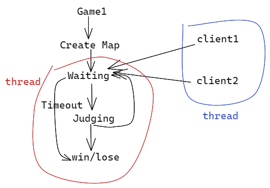
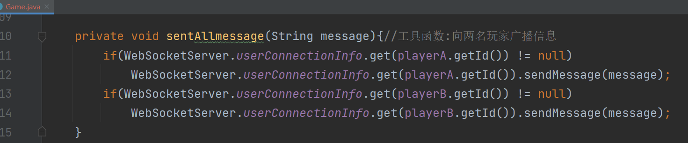

## 流程分析


整个匹配的过程是异步过程，也就是在Matching system中执行匹配的过程，会执行一个未知的时间，当出现符合条件的匹配结果时，才会立即将结果返回给前端。这种流程很难用之前的Http来达到预期效果（http为请求一次返回一次，且一般立即响应）。对于匹配系统，请求一次，返回的时间位置，而且可能多次返回。

用websocket协议，不仅客户端可以向服务器主动发送请求，服务器也可以主动向客户端发送请求，是一种对称的通信方式。


之前的地图生成方式，是在用户本地（浏览器中）随机生成，如果两名玩家都在本地实现地图，地图就会产生冲突。因此，需要将生成地图的整个过程，由服务器统一完成。此外，判断游戏是否失败的逻辑（蛇撞击），如果在用户本地（浏览器）中实现，就可能会导致用户作弊。所以，不仅是生成地图，而是整个游戏的过程（蛇的移动、判定），都要做服务器端统一完成，服务器端的相关参数、判定结果返回给前端，前端只用来渲染画面，不做任何判定逻辑。


### websocket原理

将前端建立的每个websocket连接在后端维护起来

添加`consumer.WebSocketServer`类

```java
package com.kob.backend.consumer;

import org.springframework.stereotype.Component;

import javax.websocket.*;
import javax.websocket.server.PathParam;
import javax.websocket.server.ServerEndpoint;

@Component
@ServerEndpoint("/websocket/{token}")  // 注意不要以'/'结尾
public class WebSocketServer {
    @OnOpen
    public void onOpen(Session session, @PathParam("token") String token) {
        // 建立连接
    }

    @OnClose
    public void onClose() {
        // 关闭链接
    }

    @OnMessage
    public void onMessage(String message, Session session) {
        // 从Client接收消息
    }

    @OnError
    public void onError(Session session, Throwable error) {
        error.printStackTrace();
    }
}
```

在用户开始匹配的时候，每个client向后端发送一个请求，就会在后端开辟一个线程，创建并维护一个websocket连接（实际上就是new一个WebSocketServer类的实例）

```java
WebSocketServer client1 = new WebSocketServer();
WebSocketServer client2 = new WebSocketServer();
```

后端接收到请求之后，将信息发送给匹配系统。

## 集成WebSocket

1）在`pom.xml`文件中添加依赖：

- `spring-boot-starter-websocket`
- `fastjson`

2）添加`config.WebSocketConfig`配置类：

```java
package com.kob.backend.config;

import org.springframework.context.annotation.Bean;
import org.springframework.context.annotation.Configuration;
import org.springframework.web.socket.server.standard.ServerEndpointExporter;

@Configuration
public class WebSocketConfig {

    @Bean
    public ServerEndpointExporter serverEndpointExporter() {

        return new ServerEndpointExporter();
    }
}
```

3）添加`consumer.WebSocketServer`类

```java
package com.kob.backend.consumer;

import org.springframework.stereotype.Component;
import javax.websocket.*;
import javax.websocket.server.PathParam;
import javax.websocket.server.ServerEndpoint;

@Component
@ServerEndpoint("/websocket/{token}")  // 注意不要以'/'结尾
public class WebSocketServer {
    @OnOpen
    public void onOpen(Session session, @PathParam("token") String token) {
        //  建立连接时自动调用
    }

    @OnClose
    public void onClose() {
        // 关闭链接时自动调用
    }

    @OnMessage
    public void onMessage(String message, Session session) {
        // Server从Client接收消息时触发
    }

    @OnError
    public void onError(Session session, Throwable error) {
        error.printStackTrace();
    }
}
```

上面最核心的一个函数是`onMessage`，负责Server从Client接收消息时处理相关逻辑。那如何在通过后端，向前端client发送信息呢？

定义`Session`对象，每个连接本质上是通过`Session`维护

```java
private Session session = null;
```

新增`sendMessage`函数，用于后端向当前连接发送信息

```java
public void sendMessage(String message){
    // Server发送消息
    synchronized (this.session){
        try{
            this.session.getBasicRemote().sendText(message);
        }catch (IOException e){
            e.printStackTrace();
        }
    }
}
```

另外还需要存储下每个`connection`对应的用户是谁，这样才能清楚哪两个用户之间发生了匹配，用户信息也要存储到`Session`中。并且需要根据用户的`ID`，找到相应的`WebSocketServer`连接是哪一个，所以将两者的映射关系存储在`ConcurrentHashMap`中，`ConcurrentHashMap`是一个线程安全的哈希表

```java
private User user;
private static ConcurrentHashMap<Integer,WebSocketServer>
    userConnectionInfo = new ConcurrentHashMap<>();
```

由于`WebSocket`不属于`Spring`的一个组件，不是单例模式，因此，注入`mapper`的方式有些区别

```java
private static UserMapper userMapper;

@Autowired
public void setUserMapper(UserMapper userMapper){
    WebSocketServer.userMapper = userMapper;
}
```

在建立连接时，需要建立用户ID与`WebSocketServer`实例的映射

```java
@OnOpen
public void onOpen(Session session, @PathParam("token") String token) {
    // 建立连接时自动调用
    this.session = session;
    System.out.println("Connected!");
    int userId = Integer.parseInt(token);//假设token为userId
    this.user = userMapper.selectById(userId);
    userConnectionInfo.put(userId, this);
}
```

在关闭连接时，删除这种映射

```java
@OnClose
public void onClose() {
    // 关闭链接时自动调用
    System.out.println("Disconnected!");
    if(this.user != null){
        userConnectionInfo.remove(this.user.getId());
    }
}
```

此时的`WebSocketServer.java`为：

```java
@Component
@ServerEndpoint("/websocket/{token}")  // 注意不要以'/'结尾
public class WebSocketServer {
    private User user;
    private static ConcurrentHashMap<Integer,WebSocketServer>
            userConnectionInfo = new ConcurrentHashMap<>();
    private Session session = null;

    private static UserMapper userMapper;

    @Autowired
    public void setUserMapper(UserMapper userMapper){
        WebSocketServer.userMapper = userMapper;
    }
    @OnOpen
    public void onOpen(Session session, @PathParam("token") String token) {
        // 建立连接时自动调用
        this.session = session;
        System.out.println("Connected!");
        int userId = Integer.parseInt(token);//假设token为userId
        this.user = userMapper.selectById(userId);
        userConnectionInfo.put(userId, this);
    }

    @OnClose
    public void onClose() {
        // 关闭链接时自动调用
        System.out.println("Disconnected!");
        if(this.user != null){
            userConnectionInfo.remove(this.user.getId());
        }
    }

    @OnMessage
    public void onMessage(String message, Session session) {
        // Server从Client接收消息时触发
        System.out.println("Receive message!");
    }

    @OnError
    public void onError(Session session, Throwable error) {
        error.printStackTrace();
    }

    public void sendMessage(String message){
        synchronized (this.session){
            try{
                this.session.getBasicRemote().sendText(message);
            }catch (IOException e){
                e.printStackTrace();
            }
        }
    }
}
```

4）配置`config.SecurityConfig`，将`/websocket/{token}`一类的`url`链接全部放行

```java
@Override
public void configure(WebSecurity web) throws Exception {
    web.ignoring().antMatchers("/websocket/**");
}
```

## 接口调试

我们在`views\pk\PkIndexView.vue`中对`WebSocket`进行测试

期望在当前组件被加载成功之后，建立一个连接。

需要引入`vue`的两个与生命周期有关的函数

- `onMounted`是当组件被挂载完成之后执行的函数
- `onUnmounted`是当组件被卸载之后执行的函数

同时，需要将`WebSocket`存储到全局变量中，在store中开一个新的module用于存储所有和pk相关的全局变量

`src\store\pk.js`

```js
export default ({
    state: {
       status:"matching",//matching表示匹配界面 playing表示对战界面
       socket:null,//存储前后端建立的connection
       opponent_username:"",//对手名
       opponent_photo:"",//对手头像
    },
    mutations: {
      
    },
    actions: {
       
    },
    modules: {
    }
  })
```

由于在成功创建连接之后，需要将连接信息，存储到全局变量中

所以需要在`src\store\pk.js`实现几个辅助函数

```js
export default ({
    state: {
       status:"matching",//matching表示匹配界面 playing表示对战界面
       socket:null,//存储前后端建立的connection
       opponent_username:"",//对手名
       opponent_photo:"",//对手头像
    },
    mutations: {
      updateSocket(state, socket){
        state.socket = socket;
      },
      updateOpponent(state, opponent){
        state.opponent_username = opponent.username;
        state.opponent_photo = opponent.photo;
      },
      updateStatus(state, status){
        state.status = status;
      }
    },
    actions: {
       
    },
    modules: {
    }
  })
```

然后在`views\pk\PkIndexView.vue`引入全局变量`useStore`

在当前组件被挂载的时候（可以简单理解为页面被打开的时候），也就是`onMounted`执行的时候，我们需要创建`connection`，在`onUnmounted`执行的时候，关闭连接。

```js
export default {
    components:{
        PlayGround
    },
    setup() {
        const store = useStore();
        const socketUrl = `ws://127.0.0.1:3000/websocket/${store.state.user.id}`;
        let socket = null;
        onMounted(() => {
            socket = new WebSocket(socketUrl);
            socket.onopen = () => {//如果连接成功，将socket存储到全局变量中
                console.log("connected!");
                store.commit("updateSocket",socket);
            }
            socket.onmessage = msg =>{
                const data = JSON.parse(msg.data);
                console.log(data);
            }
            socket.onclose = () =>{
                console.log("disconnected!");
            }
        });

        onUnmounted(()=>{
            socket.close();
        })
    }
}
```

### 建立连接

当进入到对战页面时，可以在后端和浏览器的控制台中看到连接成功的输出


此时如果切换到其他页面，又会断开连接


注意如果刷新页面，就会先断开连接，后建立连接


而且，必须要在页面卸载时，关闭连接

```js
onUnmounted(()=>{
	socket.close();
})
```

否则，切换到其他页面的时候，没有关闭连接，但是在每一次进来的时候，又会创建连接


刷新或者关闭时，会关闭所有的连接，从输出看出不止一个


所以，如果不进行正常关闭，在切换到其他页面时，旧连接不会关闭，因此会产生很多冗余的连接。

在成功连接后，后端输出获取到的用户信息如下：


此时建立连接时，是直接将用户的ID传输过来，但这样显然是不安全的，因为前端可以通过修改`{token}`的方式，伪装成任意一个用户的身份建立连接，因此需要添加验证，这里仍然是使用`Jwt`进行验证

### Jwt验证

前端直接将`jwt-token`传过去

```js
const socketUrl = `ws://127.0.0.1:3000/websocket/${store.state.user.token}`;
```

后端验证的方式，在`config.filter.JwtAuthenticationTokenFilter`已经给出

那就是就是如果能从`token`中解析出`userId`就认为是合法的，否则就是不合法

```java
String userid;
try {
    Claims claims = JwtUtil.parseJWT(token);
    //如果能解析出userid表示合法 否则不合法
    userid = claims.getSubject();
} catch (Exception e) {
    throw new RuntimeException(e);
}
```

为了日后方便，将这段代码提出，放在一个单独的工具类`consumer.utils.JwtAuthentication`中

```java
package com.kob.backend.consumer.utils;

import com.kob.backend.utils.JwtUtil;
import io.jsonwebtoken.Claims;
public class JwtAuthentication {
    public static Integer getUserId(String token){
        int userId = -1;
        try {
            Claims claims = JwtUtil.parseJWT(token);
            //如果能解析出userid表示合法 否则不合法
            userId = Integer.parseInt(claims.getSubject());
        } catch (Exception e) {
            throw new RuntimeException(e);
        }
        return userId;
    }
}
```

此时`WebSocketServer.java`中`onOpen`函数体更新为

```java
@OnOpen
public void onOpen(Session session, @PathParam("token") String token) throws IOException {
    // 建立连接时自动调用
    this.session = session;
    System.out.println("Connected!");
    int userId = JwtAuthentication.getUserId(token);
    this.user = userMapper.selectById(userId);
    if(this.user != null)
        userConnectionInfo.put(userId, this);
    else
        this.session.close();
}
```

这样就能够成功实现`jwt`验证

## 前端实现

此时前端还只有对战界面，并没有匹配界面，我们需要实现匹配界面，以及匹配界面和对战界面的切换

与切换有关的全局变量，就是在`pk.js`中定义的`status`， `matching`表示匹配界面，`playing`表示对战界面

那就需要当`status`为`playing`的时候再显示对战页面

```vue
<template>
    <PlayGround v-if="$store.state.pk.status === 'playing'"/>
</template>
```

并且需要创建一个新的组件`MatchGround.vue`，用于表示匹配界面

```vue
<template>
    <div class="matchground">
        <div class="row">
            <div class="col-6">
                <div class="user_photo">
                    
                </div>
                <div class="user_username">
                    {{ $store.state.user.username }}
                </div>
            </div>
            <div class="col-6">
                <div class="user_photo">
                    
                </div>
                <div class="user_username">
                    {{ $store.state.pk.opponent_username }}
                </div>
            </div>
        </div>
        <div class="row">
            <div class="col-12" style="text-align:center; padding-top:12vh">
                    <button @click="click_match_btn" class="btn btn-success btn-lg">{{match_btn_info}}</button>
            </div>
        </div>
    </div>
</template>
```

为按钮绑定一个`click_match_btn`触发函数，当点击"开始匹配"，使用`WebSocket`的`sent`API向后端发送包含`event:"start-matching"`的字符串（注意，`JSON.stringify`是将`JSON`格式处理为字符串，后续还可以恢复`JSON`格式）

```js
<script>
import { ref } from 'vue'
import { useStore } from 'vuex';
export default {
    setup(){
        const store = useStore();
        let match_btn_info = ref("开始匹配");
        const click_match_btn = () =>{
            if(match_btn_info.value === "开始匹配"){
                match_btn_info.value = "取消";
                //JSON.stringify将JSON转换为字符串
                store.state.pk.socket.sent(JSON.stringify({
                    event:"start-matching",
                }));
            }else{
                match_btn_info.value = "开始匹配";
                store.state.pk.socket.sent(JSON.stringify({
                    event:"stop-matching",
                }));
            }
        };
        return{
            match_btn_info,
            click_match_btn,
        }
    }
}
</script>
```

后端收到请求时，就会将`message`字符串解析为`JSON`格式，然后根据`event`值来分配给不同的任务

```java
private void startMatching(){
    System.out.println("start matching!");
}
private void stopMatching(){
    System.out.println("stop matching!");
}
@OnMessage
public void onMessage(String message, Session session) {//当做路由 分配任务
    // Server从Client接收消息时触发
    System.out.println("Receive message!");
    JSONObject data = JSONObject.parseObject(message);//将字符串解析成JSON
    String event = data.getString("event");
    if("start-matching".equals(event)){//防止event为空的异常
        startMatching();
    } else if ("stop-matching".equals(event)) {
        stopMatching();
    }
}
```

在后端需要建立一个线程安全的Set作为匹配池

```java
private static CopyOnWriteArraySet<User> 
        matchpool = new CopyOnWriteArraySet<>();
```

然后在相应的时间添加和删除

```java
@OnClose
public void onClose() {
    // 关闭链接时自动调用
    System.out.println("Disconnected!");
    if(this.user != null){
        userConnectionInfo.remove(this.user.getId());
        matchpool.remove(this.user);
    }
}

private void startMatching(){
    System.out.println("start matching!");
    matchpool.add(this.user);
}
private void stopMatching(){
    System.out.println("stop matching!");
    matchpool.remove(this.user);
}
```

由于现在还没有实现微服务，暂时先实现一个傻瓜式的匹配，也就是匹配池中大于等于两个用户的时候，就实现两两匹配，也就是两个用户`user1`和`user2`，并通过两个用户自己的连接，告诉前端匹配成功的相关消息

```java
private void startMatching(){
    System.out.println("start matching!");
    matchpool.add(this.user);
    while (matchpool.size() >= 2){
        Iterator<User> iterator = matchpool.iterator();
        User user1 = iterator.next();
        User user2 = iterator.next();
        matchpool.remove(user1);
        matchpool.remove(user2);
        //分别给user1和user2传送消息告诉他们匹配成功了
        //通过user1的连接向user1发消息
        JSONObject resp1 = new JSONObject();
        resp1.put("event","start-matching");
        resp1.put("opponent_username",user2.getUsername());
        resp1.put("opponent_photo",user2.getPhoto());
        WebSocketServer webSocketServer1 = userConnectionInfo.get(user1.getId());//获取user1的连接
        webSocketServer1.sendMessage(resp1.toJSONString());

        //通过user2的连接向user2发消息
        JSONObject resp2 = new JSONObject();
        resp2.put("event","start-matching");
        resp2.put("opponent_username",user1.getUsername());
        resp2.put("opponent_photo",user1.getPhoto());
        WebSocketServer webSocketServer2 = userConnectionInfo.get(user2.getId());
        webSocketServer2.sendMessage(resp2.toJSONString());
    }
}
```

在前端的`PkIndexView.vue`中，当接收到后端发送的消息之后，相关逻辑的实现在`onmessage`函数中

如果匹配成功，就要更新对手信息


### 匹配测试

注意，需要两个用户进行测试的话，必须在两个不同的浏览器中。一个浏览器只能允许同时登录一个用户，因为在`Local Storage`中会共用一个`jwt_token`


前端如何匹配成功，就更新对手的用户名和头像。

```js
import PlayGround from '../../components/PlayGround.vue'
import MatchGround from '../../components/MatchGround.vue'
import { onMounted } from 'vue'
import { onUnmounted } from 'vue'
import { useStore } from 'vuex'
export default {
    components:{
        PlayGround,
        MatchGround
    },
    setup() {
        const store = useStore();
        const socketUrl = `ws://127.0.0.1:3000/websocket/${store.state.user.token}`;
        let socket = null;
        onMounted(() => {

            store.commit("updateOpponent",{
                username:"我的对手",
                photo:"https://cdn.acwing.com/media/article/image/2022/08/09/1_1db2488f17-anonymous.png",
            });
            socket = new WebSocket(socketUrl);
            socket.onopen = () => {//如果连接成功，将socket存储到全局变量中
                console.log("connected!");
                store.commit("updateSocket",socket);
            }
            socket.onmessage = msg =>{
                const data = JSON.parse(msg.data);
                console.log(data);
                if(data.event === "start-matching"){
                    store.commit("updateOpponent",{
                        username:data.opponent_username,
                        photo:data.opponent_photo
                    });
                    // store.commit("updateStatus","playing")
                }

            }
            socket.onclose = () =>{
                console.log("disconnected!");
            }
        });

        onUnmounted(()=>{
            socket.close();
        })
    }
}
```


然后在匹配成功之后，设置延迟两秒显示，然后跳转到对战页面


如果切换其他页面再切换回来的时候，地图又发生了变化，期望点击其他页面的时候自动放弃，再切换回来的时候，重新回到匹配页面。

那就需要在卸载页面（`onUnmounted`）的时候，不仅需要断开连接，同时还要将状态切换为`matching`状态。

但此时有一个很大的问题，就是两个人的游戏地图不一致。这是因为地图是在浏览器本地生成，为了解决同步问题，需要由服务器统一接管。

## 地图同步

接下来需要在服务器端实现之前分析的Game流程


添加`consumer.utils.Game.java`，用于管理整个游戏流程

参考`assets\scripts\GameMap.js`

画地图参考`GameMap.js`中`create_walls()`函数

```java
import java.util.Random;

public class Game {
    final private Integer rows;
    final private Integer cols;
    final private Integer inner_walls_count;
    final private int[][] g;
    //辅助数组
    final private static int[] dx = {-1,0,1,0};
    final private static int[] dy = {0,1,0,-1};
    public Game(Integer rows, Integer cols, Integer inner_walls_count) {
        this.rows = rows;
        this.cols = cols;
        this.inner_walls_count = inner_walls_count;
        this.g = new int[rows][cols];
    }

    public int[][] getG() {//返回地图
        return g;
    }

    private boolean check_connectivity(int sx, int sy,int tx, int ty){
        if (sx == tx && sy == ty)
            return true;
        g[sx][sy] = 1;

        for(int i = 0; i < 4; i++){
            int x = sx + dx[i];
            int y = sy + dy[i];
            if(x >= 0 && x < this.rows && y >= 0 && y < this.cols && g[x][y] == 0){
                if(check_connectivity(x, y, tx, ty)){
                    g[sx][sy] = 0;//恢复现场
                    return true;
                }
            }
        }
        g[sx][sy] = 0;//恢复现场
        return false;
    }
    private boolean draw(){//绘制地图
        for (int i = 0; i < this.rows; i++) {
            for (int j = 0; j < this.cols; j++) {
                g[i][j] = 0;//0表示可通行区域 1表示障碍物
            }
        }
        //给四周加上障碍物
        for(int r = 0; r < this.rows; r++){//给左右两侧设置为1
            g[r][0]=1;
            g[r][this.cols-1]=1;
        }

        for(int c = 0; c < this.cols; c++){//给上下两侧设置为1
            g[0][c] = g[this.rows-1][c] = 1;
        }

        //在内部随机生成inner_walls_count个对称的障碍物
        Random random = new Random();
        for(int i = 0; i < this.inner_walls_count / 2; i++){
            for (int j = 0; j < 1000; j++) {
                int r = random.nextInt(this.rows);//返回0~rows-1的随机值
                int c = random.nextInt(this.cols);//返回0~cols-1的随机值
                if(g[r][c] == 1 || g[this.rows - 1 - r][this.cols - 1 - c] == 1)
                    continue;//已经有了 不能重复添加 直接进入下一轮循环 j++
                if(r == this.rows - 2 && c == 1 || r == 1 && c == this.cols-2)
                    continue;//保证左上角和右下角不能有障碍物

                //成功设置一个障碍物后 直接退出当前for i++
                g[r][c] = g[this.rows - 1 - r][this.cols - 1 - c] = 1;
                break;
            }
        }
        //判断连通性
        return check_connectivity(this.rows-2,1,1,this.cols-2);
    }
    public void createMap(){
        for (int i = 0; i < 1000; i++) {
            if(draw())
                break;
        }
    }
}
```

然后在`WebSocketServer.java`

当开始匹配的时候，实例化一个Game对象用于生成地图，并将生成的地图返回给连接中的两个用户。

> 当然，最终的地图应该是保存在webSocket中，也就是只对当前匹配的两个用户可见，对其他连接的用户不可见，这一点放在后面实现。

```java
private void startMatching(){
    System.out.println("start matching!");
    matchpool.add(this.user);
    while (matchpool.size() >= 2){
        Iterator<User> iterator = matchpool.iterator();
        User user1 = iterator.next();
        User user2 = iterator.next();
        matchpool.remove(user1);
        matchpool.remove(user2);
        Game game = new Game(13,14,20);
        game.createMap();

        JSONObject resp1 = new JSONObject();
        resp1.put("event","start-matching");
        resp1.put("opponent_username",user2.getUsername());
        resp1.put("opponent_photo",user2.getPhoto());
        resp1.put("gamemap",game.getG());
        WebSocketServer webSocketServer1 = userConnectionInfo.get(user1.getId());
        webSocketServer1.sendMessage(resp1.toJSONString());

        JSONObject resp2 = new JSONObject();
        resp2.put("event","start-matching");
        resp2.put("opponent_username",user1.getUsername());
        resp2.put("opponent_photo",user1.getPhoto());
        resp2.put("gamemap",game.getG());
        WebSocketServer webSocketServer2 = userConnectionInfo.get(user2.getId());
        webSocketServer2.sendMessage(resp2.toJSONString());
    }
}
```

此时后端可以返回地图，前端写好接收地图的逻辑

`src\store\pk.js`

```js
export default ({
    state: {
       status:"matching",//matching表示匹配界面 playing表示对战界面
       socket:null,//存储前后端建立的connection
       opponent_username:"",//对手名
       opponent_photo:"",//对手头像
       gamemap:null//地图
    },
    mutations: {
      updateSocket(state, socket){
        state.socket = socket;
      },
      updateOpponent(state, opponent){
        state.opponent_username = opponent.username;
        state.opponent_photo = opponent.photo;
      },
      updateStatus(state, status){
        state.status = status;
      },
      updayeGamemap(state, gamemap){
        state.gamemap = gamemap;
      }
    },
    actions: {
       
    },
    modules: {
    }
  })
```

`src\views\pk\PkIndexView.vue`

```js
socket.onmessage = msg => {
                const data = JSON.parse(msg.data);
                console.log(data);
                if (data.event === "start-matching") {
                    store.commit("updateOpponent", {
                        username: data.opponent_username,
                        photo: data.opponent_photo
                    });
                    //匹配成功后，延时2秒，进入对战页面
                    setTimeout(() => {
                        store.commit("updateStatus", "playing")
                    }, 2000);
                    store.commit("updateGamemap",data.gamemap)//更新地图
                }

            }
```

后端获取`gamemap`并更新到全局变量之后，要将获取到的`gamemap`渲染到画布上

首先在组件`GameMap.vue`中将全局变量`store`传递到`GameMap`的构造函数中

`src\components\GameMap.vue`

```vue
<script>
import { GameMap } from '../assets/scripts/GameMap'
import {onMounted, ref} from 'vue' //用于定义变量
import { useStore } from 'vuex';
export default {
    setup(){
        const store = useStore();
        let parent = ref(null);
        let canvas = ref(null);
        onMounted(()=>{
            new GameMap(canvas.value.getContext('2d'), parent.value, store)
        });
        return{
            parent,
            canvas
        }
    }
}
</script>
```

对于`scripts\GameMap.js`

相关的代码更新为：

```js
export class GameMap extends GameObject {
    constructor(ctx, parent, store){
        super();

        this.ctx = ctx;
        this.parent = parent;
        this.store = store;
        this.L = 0;
        this.rows = 13;
        this.cols = 14;
        this.inner_walls_count = 10;//定义内部障碍物数量
        this.walls = [];//用于保存障碍物,属于对象数组

        this.snakes = [
            new Snake({id:0, color:"#4876EC",r: this.rows - 2, c: 1},this),
            new Snake({id:1, color:"#F94848",r: 1, c: this.cols - 2},this),
        ];
    }
   
    //画地图:创建障碍物
    create_walls(){
        //直接将地图取出--后端传过来
        console.log(this.store)
        const g = this.store.state.pk.gamemap;
        //创建障碍物对象 并添加到this.walls数组
        for(let r = 0; r < this.rows; r++){
            for(let c = 0; c < this.cols; c++){
                if(g[r][c]){
                    this.walls.push(new Wall (r,c,this));
                }
            }
        }
    }
    start(){
        this.create_walls();//不用循环1000次了 因为直接接收的后端生成的
        this.add_listening_events();
    }
```

至此，就解决了地图同步问题


## 玩家位置同步

### 后端修改

玩家的位置也要在服务端确定，确定完之后将每个玩家的位置传到前端。

添加一个玩家类

`consumer.utils.Game.java`

```java
import java.util.List;

@Data
@AllArgsConstructor
@NoArgsConstructor
public class Player {
    private Integer id;
    private Integer sx;//起始x坐标
    private Integer sy;//起始y坐标
    private List<Integer> steps;//保存每一步操作---决定了蛇当前的形状
}
```

在初始化`Game`的时候，实例化两个`Player`对象


在`WebSocketServer.java`中，为了方便管理，将与`Game`相关的信息，封装成一个`JSON`


这样后端就可以将两名玩家的信息（包括生成的地图）传送给前端

### 前端修改

在`src\store\pk.js`中添加玩家信息的变量和更新函数

```js
export default ({
    state: {
       status:"matching",//matching表示匹配界面 playing表示对战界面
       socket:null,//存储前后端建立的connection
       opponent_username:"",//对手名
       opponent_photo:"",//对手头像
       gamemap:null,
       a_id:0,
       a_sx:0,
       a_sy:0,
       b_id:0,
       b_sx:0,
       b_sy:0,
    },
    mutations: {
      updateSocket(state, socket){
        state.socket = socket;
      },
      updateOpponent(state, opponent){
        state.opponent_username = opponent.username;
        state.opponent_photo = opponent.photo;
      },
      updateStatus(state, status){
        state.status = status;
      },
      updateGame(state, game){
        state.a_id = game.a_id;
        state.a_sx = game.a_sx;
        state.a_sy = game.a_sy;
        state.b_id = game.b_id;
        state.b_sx = game.b_sx;
        state.b_sy = game.b_sy;
        state.gamemap = game.map;
      },
    },
    actions: {
       
    },
    modules: {
    }
  })
  
```

在`src\views\pk\PkIndexView.vue`中，在`onmessage`中，调用`updateGame`函数

```vue
<script>
import PlayGround from '../../components/PlayGround.vue'
import MatchGround from '../../components/MatchGround.vue'
import { onMounted } from 'vue'
import { onUnmounted } from 'vue'
import { useStore } from 'vuex'
export default {
    components: {
        PlayGround,
        MatchGround
    },
    setup() {
        const store = useStore();
        const socketUrl = `ws://127.0.0.1:3000/websocket/${store.state.user.token}`;
        let socket = null;
        onMounted(() => {
            ....//省略
            socket.onmessage = msg => {
                const data = JSON.parse(msg.data);
                console.log(data);
                if (data.event === "start-matching") {
                    store.commit("updateOpponent", {
                        username: data.opponent_username,
                        photo: data.opponent_photo
                    });
                    //匹配成功后，延时2秒，进入对战页面
                    setTimeout(() => {
                        store.commit("updateStatus", "playing")
                    }, 2000);
                    store.commit("updateGame",data.game)//更新Game:包括玩家信息和地图
                }
            }
            socket.onclose = () => {
                console.log("disconnected!");
            }
        });

        onUnmounted(() => {
            socket.close();
            store.commit("updateStatus", "matching");
        })
    }
}
</script>
```

运行项目，使用用户名sun和用户名hong的登录，两个浏览器控制台`console.log(data.game)`的输出内容一致，均为，同步成功


## 游戏同步：多线程

### 分析过程

之前只是两个，在浏览器本地通过wsad和上下左右来控制移动。

现在三个，两个client和一个server，需要实现三个的同步


再来梳理一下之前的游戏流程


对于从等待用户 or Bot输入到判别系统这一过程是独立的，


但是一般代码的执行是单线程，也就是按照顺序执行，例如如果在当前线程执行操作，当等待用户输入的时候，线程就会卡死，需要我们这样一个线程中有多个游戏在运行，只有Game1结束之后才能跑Game2，这样在第二个对局中，玩家就会漫长的等待。


因此，Game不能作为一个单线程来处理，因此，需要另起一个新的线程来做。

也就是将Game变成一个支持多线程的类


### 多线程

首先为`WebSocketServer`增加一个成员变量，用于记录链接中的Game实例


在确定两名匹配的玩家之后，更新两名玩家的`WebSocketServer`连接上的`Game`实例值。


然后回到`Game.java`，将`Game`变成一个支持多线程的类，只需将`Game`继承`Thread`类，就可以支持多线程

```java
public class Game extends Thread
```

然后重写多线程的入口函数`run()`

在开启一个新线程执行`game.start()`的时候，新线程中的入口函数，就是`run()`

初始化两个成员变量，用于表示两名玩家的下一步操作

```java
private Integer nextStepA;
private Integer nextStepB;
public void setNextStepA(Integer nextStepA) {
    this.nextStepA = nextStepA;
}
public void setNextStepB(Integer nextStepB) {
    this.nextStepB = nextStepB;
}
```

未来会在`WebSocketServer.java`中，接收到输入的时候，调用这两个函数

也就是在蓝色的线程里面修改`nextStepA`和`nextStepB`的值，而在红色的线程里面，会读取这两个线程的值



这就涉及到两个线程会同时读写一个变量，可能会产生读写冲突，需要加锁

定义一个锁

```java
private ReentrantLock lock = new ReentrantLock();
```

之后在`setNextStepA`和`setNextStepB`中

对两个变量进行更新之前，先锁上，操作完之后，解锁（不管有没有报异常）

```java
public void setNextStepA(Integer nextStepA) {
    lock.lock();
    try {
        this.nextStepA = nextStepA;
    }finally {
        lock.unlock();
    }
}
public void setNextStepB(Integer nextStepB) {
    lock.lock();
    try {
        this.nextStepB = nextStepB;
    }finally {
        lock.unlock();
    }
}
```

在`nextStep()`函数中，负责等待两名玩家的输入，如果都在指定时间内输入了，就返回`true`

```java
private boolean nextStep(){//等待两名玩家的下一步操作
    //由于前端动画200ms才能画一个格子
    //如果在此期间接收到的输入多于一步 只会留最后一步 多余的会被覆盖
    //因此在每一个下一步都要先休息200ms
    try {
        Thread.sleep(200);
    } catch (InterruptedException e) {
        e.printStackTrace();
    }

    //如果5秒内有玩家没有输入 就返回false
    for (int i = 0; i < 5; i++) {
        try {
            Thread.sleep(1000);
            lock.lock();
            try {
                if(nextStepA != null && nextStepB != null){
                    playerA.getSteps().add(nextStepA);
                    playerB.getSteps().add(nextStepB);
                    return true;
                }
            }finally {
                lock.unlock();
            }
        } catch (InterruptedException e) {
           e.printStackTrace();
        }
    }
    return false;
}
```

如果其中一个超时没有输入，游戏就终止，并且分出胜负。

因此还需要定义一个游戏状态`status`和谁输了`loser`

```java
private String status = "playing";//游戏状态 playing-->finished
private String loser = "";//all:平; A:A输; B:B输了
```

最后，在线程的入口`run()`中初始逻辑如下

```java
@Override
public void run() {
    for (int i = 0; i < 1000; i++) {//1000步之内游戏肯定结束
        if(nextStep()){
            //如果获取两个玩家的下一步操作
        }else {
            status = "finished";
            if(nextStepA == null && nextStepB == null){
                loser = "all";
            } else if (nextStepA == null) {
                loser = "A";
            } else{
                loser = "B";
            }
        }
    }
}
```

但是上面这段逻辑有个问题，如果两名玩家在五秒内没有给出操作，就会进入`else`判断，此时本应该是平均，也就是`loser = "all"`，但如果下面这段代码执行时，用户给出了输入，结果就会不符合预期。

```java
if(nextStepA == null && nextStepB == null){
       loser = "all";
} else if (nextStepA == null) {
       loser = "A";
} else{
       loser = "B";
}
```

所以，由于这里涉及到变量的读操作，为了在读的过程中被修改，因此也需要加锁。读完之后再解锁。

```java
if(nextStep()){
    //如果获取两个玩家的下一步操作
    System.out.println();
}else {
    status = "finished";
    lock.lock();
    try {
        if(nextStepA == null && nextStepB == null){
            loser = "all";
        } else if (nextStepA == null) {
            loser = "A";
        } else{
            loser = "B";
        }
    }finally {
        lock.lock();
    }
}
```

然后来看`if (nextStep())`判断，如果获取两个玩家的下一步操作

需要先进行`judge()`，来判断输入是否合法

并且，虽然A和B都知道自己的操作，但是看不到对方的操作，因此需要中心服务器以广播的形式来告知。


```java
@Override
public void run() {
    for (int i = 0; i < 1000; i++) {//1000步之内游戏肯定结束
        if (nextStep()) {
            //如果获取两个玩家的下一步操作
            judge();
            if(status.equals("playing")){
                sentMove();
            }else {
                sentResult();
                break;
            }
        } else {
            status = "finished";
            lock.lock();
            try {
                if (nextStepA == null && nextStepB == null) {
                    loser = "all";
                } else if (nextStepA == null) {
                    loser = "A";
                } else {
                    loser = "B";
                }
            } finally {
                lock.lock();
            }
            sentResult();
            break;
        }
    }
}
```

而其中暂时不实现`judge`的逻辑，其他辅助函数的逻辑如下

```java
private void sentAllmessage(String message){//工具函数:向两名玩家广播信息
    WebSocketServer.userConnectionInfo.get(playerA.getId()).sendMessage(message);
    WebSocketServer.userConnectionInfo.get(playerB.getId()).sendMessage(message);
}
private void sentMove() {//向两个Client广播玩家操作信息
    lock.lock();//凡是对操作进行读写的操作 都要加锁
    try{
        JSONObject resp = new JSONObject();
        resp.put("event","move");
        resp.put("a_direction",nextStepA);
        resp.put("b_direction",nextStepB);
        nextStepA = nextStepB = null;//清空操作
        sentAllmessage(resp.toJSONString());
    }finally {
        lock.unlock();
    }
}

private void sentResult() {//向两个client公布结果信息
    JSONObject resp = new JSONObject();
    resp.put("event","result");//定义事件
    resp.put("loser",loser);
    sentAllmessage(resp.toJSONString());
}
```

这样后端基本逻辑完成，接下来是前端与后端的通信，前端要将用户的操作发送过来，以及接收并处理中心服务器的广播

### 前后端通信

此前判断蛇的移动，在`scripts\GameMap.js`

```js
 add_listening_events(){
        this.ctx.canvas.focus();//聚焦
        const [snake0, snake1] = this.snakes;
        this.ctx.canvas.addEventListener("keydown",e=>{
            console.log(e.key);
            //wasd控制左下角球 上下左右控制右上角球
            if(e.key === 'w') snake0.set_direction(0);
            else if (e.key === 'd') snake0.set_direction(1);
            else if (e.key === 's') snake0.set_direction(2);
            else if (e.key === 'a') snake0.set_direction(3);
            else if (e.key === 'ArrowUp') snake1.set_direction(0);
            else if (e.key === 'ArrowRight') snake1.set_direction(1);
            else if (e.key === 'ArrowDown') snake1.set_direction(2);
            else if (e.key === 'ArrowLeft') snake1.set_direction(3);
        });
    }
```

这里，由于一个client负责一个玩家，只处理wsad即可。

修改如下，将玩家的操作操作传送到后端

```js
 add_listening_events(){
        this.ctx.canvas.focus();//聚焦
        const [snake0, snake1] = this.snakes;
        this.ctx.canvas.addEventListener("keydown",e=>{
            console.log(e.key);
            //wasd控制移动
            let d = -1;
            if(e.key === 'w') d = 0;
            else if (e.key === 'd') d = 1;
            else if (e.key === 's') d = 2;
            else if (e.key === 'a') d = 3;

            if(d >= 0){//有效输入
                this.store.state.pk.socket.sent(JSON.stringify({//将JSON转换为字符串
                    event:"move",
                    direction:d,
                }))
            }
        });
    }
```

后端接收并分配给专门的路由来进行处理

```java
private void move(Integer direction) {
    //判断是A玩家还是B玩家在操作
    if(game.getPlayerA().getId().equals(user.getId())){
        game.setNextStepA(direction);
    }else if (game.getPlayerB().getId().equals(user.getId())) {
        game.setNextStepB(direction);
    } else {
        Exception e = new Exception("Error");
        e.printStackTrace();
    }
}
@OnMessage
public void onMessage(String message, Session session) {//当做路由 分配任务
    // Server从Client接收消息时触发
    System.out.println("Receive message!");
    JSONObject data = JSONObject.parseObject(message);//将字符串解析成JSON
    String event = data.getString("event");
    if("start-matching".equals(event)){//防止event为空的异常
        startMatching();
    } else if ("stop-matching".equals(event)) {
        stopMatching();
    } else if ("move".equals(event)) {
       	Integer direction = data.getInteger("direction");
        System.out.println(direction);
        move(direction);
    }
}
```

此时，client端用户输入WSAD的时候，后端就能准确接收到信息。


同时，前端也要接收后端的广播来的信息，具体有两种`event`，分别是`move`和`result`

### 1) event == move


对操作进行更新需要用到`Snack.js`中的`set_direction`方法


两个玩家控制的`snack`对象在保存在`GameMap`对象中。


为了取到，需要将`GameMap`对象，作为游戏对象，保存为全局变量


先在`src\store\pk.js`中将`gameObject`存入全局变量，并写好更新函数


这样就能获取到游戏对象，并且更新两个玩家控制的`snack`的方向


此时，两个玩家都能够控制蛇正常移动


但是每次输入之后都会感觉到一些延迟，是因为输入之后可能线程还处于睡眠状态


调整为：


### 2) event == result

之前判断玩家输赢（蛇的状态）的逻辑在前端

```js
//如果下一步操作撞了 蛇瞬间去世
if(!this.gamemap.check_valid(this.next_cell)){
this.status = "die";
}
```


将这段代码去掉。现在要交由后端来播报结果。

判断输赢有两部分逻辑：撞墙和超时，超时的逻辑已经写好，现在写判断撞墙的逻辑

参考前端`GameMap.js`中的`check_valid(cell)`函数


后端逻辑如下：

1）首先需要将两名玩家所控制的蛇取到：

新建`Cell`类代表蛇的单元

```java
@Data
@AllArgsConstructor
@NoArgsConstructor
public class Cell {
    private Integer x;
    private Integer y;
}
```

在`Player.java`中，将蛇的身体返回

0、1、2、3位置表示表示上右下左


对于四种操作`0(w), 1(d), 2(s), 3(a)`分别在行和列方向上的偏移量

```java
int[] dx = {-1, 0, 1, 0};//行方向的偏移量
int[] dy = {0, 1, 0, -1}; //列方向的偏移量
```

所以`Player.java`的逻辑更新为

```java
@Data
@AllArgsConstructor
@NoArgsConstructor
public class Player {
    private Integer id;
    private Integer sx;//起始x坐标
    private Integer sy;//起始y坐标
    private List<Integer> steps;//保存每一步操作---决定了蛇当前的形状
    //检验当前回合 蛇的长度是否增加
    private  boolean check_tail_increasing(int step){
        if(step <= 10) return true;
        else return step % 3 == 1;
    }
    //返回蛇的身体
    public List<Cell> getCells(){
        List<Cell> res = new ArrayList<>();
        //对于四种操作0(w), 1(d), 2(s), 3(a)
        // 在行和列方向上的计算偏移量
        int[] dx = {-1, 0, 1, 0};
        int[] dy = {0, 1, 0, -1};
        int x = sx;
        int y = sy;
        int step = 0;//回合数
        res.add(new Cell(x,y));//添加起点
        //不断根据steps计算出整个蛇身体
        for (Integer d : steps) {
            x += dx[d];
            y += dy[d];
            res.add(new Cell(x,y));
            if(!check_tail_increasing(++step)){
                //如果蛇尾不增加 就删掉蛇尾
                res.remove(0);//O(N)
            }
        }
        return res;
    }
}
```

2）判断两名玩家最后一步操作是否合法

* 没有撞到障碍物
* 没有撞到两条蛇的身体
  * 没有撞到自己：最后一步与之前n-1个Cell是否重合
  * 没有撞到别人：最后一步与之前n-1个Cell是否重合
    * 由于A和B不可能走到同一个格子 因此不用判断最后一个格子是否重合

只需要判断最后一步，也就是蛇的最后一个Cell是否符合上面三种原则即可。

```java
private boolean check_valid(List<Cell> cellsA, List<Cell> cellsB) {
    int n = cellsA.size();
    Cell cell = cellsA.get(n - 1);//取到A的最后一步
    //三种不合法操作: A撞墙、A撞A、A撞B
    //A撞墙
    if(g[cell.getX()][cell.getY()] == 1)
        return false;
    //A撞A
    for (int i = 0; i < n - 1; i++) {
        if(cellsA.get(i).getX().equals(cell.getX())
                && cellsA.get(i).getY().equals(cell.getY())){
            return false;
        }
    }
    //A撞B
    for (int i = 0; i < n - 1; i++) { 
        if(cellsB.get(i).getX().equals(cell.getX())
                && cellsB.get(i).getY().equals((cell.getY()))){
            return false;
        }
    }
    return true;
}
private void judge() {
    List<Cell> cellsA = playerA.getCells();
    List<Cell> cellsB = playerB.getCells();
    //判断两名玩家最后一步操作是否合法
    boolean validA = check_valid(cellsA, cellsB);
    boolean validB = check_valid(cellsB, cellsA);
    if(!validA || !validB){
        status = "finished";
        if(validA){
            loser = "B";
        } else if (validB) {
            loser = "A";
        } else {
            loser = "all";
        }
    }
}
```

此时就能正常的进行合法性判断。


### 游戏结果展示

最后，还需要将游戏的结果在前端展示，并且，设置一个重启按钮，点击重启之后，重新开始一局。

在`pk.js`中新增变量，方便用于展示谁赢谁输


新增一个组件`ResultBoard.vue`用于展示结果


核心代码如下：


然后在对战页面`PkIndexView.vue`导入组件，使其在`loser!=none`时展示出来


并且在收到后端播报结果时，更新全局变量中的loser


最终的结果如下，成功的实现了结果展示和重来一局。


点击重启


此时，再匹配的用户，又可以开始新的一轮对战。


这样，游戏同步功能就全部完成。

## 对局记录

接下来来实现另外一功能，就是将对局记录保存在数据库中。

### 创建record

1）创建`record`表用来记录每局对战的信息

表中的列：

- `id: int`
  - 非空 自增 唯一 主键
- `a_id: int`
- `a_sx: int`
- `a_sy: int`
- `b_id: int`
- `b_sx: int`
- `b_sy: int`
- `a_steps: varchar(1000)`
- `b_steps: varchar(1000)`
- `map: varchar(1000)`
- `loser: varchar(10)`
- `createtime: datetime`

2）创建Pojo

注意，数据库中如果用下划线，则在pojo中要使用驼峰命名法

```java
@Data
@AllArgsConstructor
@NoArgsConstructor
public class Record {
    @TableId(type = IdType.AUTO)
    private Integer id;
    private Integer aId;
    private Integer aSx;
    private Integer aSy;
    private Integer bId;
    private Integer bSx;
    private Integer bSy;
    private String aSteps;
    private String bSteps;
    private String map;
    private String loser;
    @JsonFormat(pattern = "yyyy-MM-dd HH:mm:ss", timezone = "Asia/Shanghai")
    private Date createtime;
}
```

3）创建Mapper

```java
@Mapper
public interface RecordMapper extends BaseMapper<Record> {
}
```

### 写入数据库

首先将`RecordMapper`实例注入到`WebSocketServer`中


在`Game.java`中，在每次向`client`播报结果之前，将记录保存到数据库


这样在每局游戏结束时，记录就被保存下来


后续就可以根据记录来复原游戏画面

## 实现匹配系统的微服务

微服务可以理解为在SpringBoot之外的另外一个Server，负责处理一段独立的功能，与SpringBoot Server之间通过http通信。在游戏的匹配系统，之前是简单粗暴的放在一个集合上，当集合元素大于2时，取出两名玩家进行匹配，无法适应更加复杂的场景，因此现在要将这段程序独立出来。


微服务有多种实现方式，这里采用SpringCloud。SpringCloud和SpringBoot都相当于一个Web Server两者之间通过Http通信


由于SpringCloud实现的匹配系统和SpringBoot实现的游戏后端是并列的，因此项目结构需要改动。

### 创建`SpringCloud`项目


### 配置`SpringCloud`项目


在`SpringCloud`项目中添加依赖：
[Maven仓库地址](https://mvnrepository.com/)
`spring-cloud-dependencies`


### 添加子项目—MatchingSystem

#### 1）添加和配置

创建`SpringCloud`的子项目——`matchingsystem`


然后需要配置一些依赖。

`matchingsystem`本质上也是一个`springboot`，所以需要将父级目录`backendcloud`中`porm.xml`中的依赖，`SpringWeb`依赖，直接复制到子项目`matchingsystem`对应的`porm.xml`


创建`application.properties`，配置端口，由于游戏后端`backend`中是3000，这里设置为3001


#### 2）匹配系统的简单布局

对于匹配系统而言，需要实现的接口中需要有两个函数，`addPlayer`和`removePlayer`用于添加和删除玩家

创建接口，就需要创建`controller`负责调用接口，`service`负责声明接口，`service.impl`负责实现接口

`MatchingService.java`


`MatchingServiceImpl.java`


`MatchingController.java`


注意，对于`MultiValueMap`结构而言，运行一个`key`对应的多个`value`，并用数组保存

`map.getFirst("user_id")`表示`user_id`所对应的`value`数组中，第一个值001


此时`MatchingController`还有一个问题是，没有授权验证，这样就有外网通过其他请求来恶意攻击的风险。

与之前`backend`一样，添加`Spring Security`依赖


照着之前的代码，只用到`configure`这一段代码，且不涉及`Jwt-token`的验证，直接抄过来修改


我们期望的的是只能被后端服务器访问，而不能以其他方式访问。解决这个问题，可以根据IP地址来判断，也就是只能通过本地，而不能通过其他地方来访问。

如下图，对`"/player/add/"`和`"/player/remove/"`的请求放开

只有IP地址为本地（127.0.0.1）的`Server`发出的请求才是有效的。


将原来的`Main`函数，重命名为`MatchingSystemApplication`，作为`Springboot`的入口


这样就能够跑起来（只不过此时由于是POST的类型的请求，不支持通过浏览器直接请求）


由于请求是游戏后端backend发起的，因此还需要将两部分对接起来。

现在需要创建一个新的子项目，将之前的逻辑装在backendclound下面

### 添加子项目—Backend

#### 1）添加和配置

在`backendcloud`下面创建`SpringCloud`的子项目——`Backend`


然后，将之前的后端`backend`项目的`src`整个文件夹直接复制过来。


复制到`backendcloud`下面的子模块`backend`下面


然后将后端`backend`项目下的`porm.xml`中的依赖也粘贴到下面这个位置


其中的`thymeleaf`用不到，删除即可。

目前的项目结构如下：


#### 2）连通匹配系统

首先要打通


需要将下面这段修改，目前还只是简单粗暴的进行从集合中取出User


修改如下：

将与`matchpool`相关的所有操作都删掉

然后在`startMatching()`调用时向`MatchingSystem`发请求，申请为玩家匹配对手，在`stopMatching()`和`onClose()` 调用时向`MatchingSystem`发请求，申请取消玩家的匹配，

##### 配置`RestTemplate`

向`MatchingSystem`发请求，需要借助`Springboot`中的一个工具`RestTemplate`，它可以在两个Spring进程之间进行通信。

先配置一下这个工具，如果希望在`WebSocketServer.java`中使用`RestTemplate`，就需要加`Bean`注解，这样才能够取出来。

可以理解为，需要用到某个工具的时候，就定义一个它的`Configuration`，加一个注解`Bean`，返回一个它的实例。


这样在未来使用的时候，就可以通过`@Autowired`将其注入


原理是，如果加了`@Autowired`，就会看一下这个接口（或者Service）是否有一个唯一的注解为`Bean`的函数和它对应，如果有的话就调用这个函数，将返回值赋过来。

现在看下怎么用。

在具体用之前，需要修改下数据库。将`rating`字段，将`bot`表中，移动到`user`表中

同样，修改这两个表对应的pojo

并且在所用调用`User`和`Bot`构造函数的时候修改


然后进入正题。

##### 使用`RestTemplate`

借助`RestTemplate`向`MatchingSystem`发请求


启动Backend模块对应的Spring服务

此时能够在服务中看到，启动了两个`SpringBoot`

`Backend`对应的端口号为3000

`MatchingSystem`对应的端口号为3001


用户登录之后，进行匹配，在`MatchingSystem`对应的控制台下面`add player1 1500`表示匹配系统接收到了来自后端的玩家ID为6的匹配请求。


当点击取消时，同样成功接收到了请求


控制台中看到的输出，是在匹配系统中实现的输出。

至此，游戏后端，向匹配系统发请求这一过程就完成。


接下来要实现匹配系统内部的逻辑。

### 匹配系统

匹配系统在接收到来自游戏后端的匹配请求之后，会将当前参与匹配的所有用户，放在一个池子（数组）里面。开辟额外新线程，每隔1s就扫描一遍整个数组，将能够匹配的玩家匹配到一起。我们期望匹配相近分值的玩家，随着时间的推移，可以逐步放宽分值要求，也就是允许两名匹配玩家的分值差距较大，直到所有玩家都可以在规定时间内匹配在一块为止。具体来说，第一秒，匹配分值差距10以内的玩家，第二秒，匹配分值差距20以内的玩家.....直到匹配完成为止。

现在需要将之前关于线程的那部分再重复一遍。

创建`service.impl.utils.MatchingPool`用于维护这样一个线程，同时创建`service.impl.utils.Player`来存储玩家（需要提前将`Lombok`依赖添加到匹配系统的`porm.xml`中）

 

对于`Player`类，需要考虑三个属性：用户名，积分值，等待时间


#### MatchingPool线程

对于`MatchingPool`，是一个多线程的类，需要继承`Thread`

* 创建一个列表`players`保存玩家
* 添加玩家的函数
* 删除玩家的函数

由于`players`变量多个线程（匹配线程，传入参数线程）共用，因此这个变量涉及到读写冲突，因此就需要加锁。还要注意，从列表中删除元素的时候，要注意重新判断该位置。


对于匹配系统而言，由于全局只有一个匹配线程，因此将其定义成静态变量，放在`MatchingServiceImpl`中。


同时在`MatchingPool`开一个线程，需要重写`Thread`的`run()`。对于线程的执行，我们期望周期性的执行，判断当前所有玩家中有没有匹配的。写一个死循环，`Thread.sleep(1000)`，每1秒中自动执行一遍。对于每一名玩家而言，每等待一秒，对应的`waitingTime`就会加一，相应的匹配阈值就会变大。


在`matchPlayers()`中，尝试匹配所有玩家


> 注意，java中的break：跳出当前循环；但是如果是嵌套循环，则只能跳出当前的这一层循环，只有逐层break才能跳出所有循环。continue：终止当前循环，但是不跳出循环(在循环中continue后面的语句是不会执行了)，继续往下根据循环条件执行循环。

以上用到的辅助函数


#### `MatchingSystem`发送请求

对于`sendResult`，负责将匹配的两名玩家作为参数返回到backend

也就是这个过程


因为也要用到`RestTemplateConfig`

所以将`backend.config.RestTemplateConfig`文件复制到`matchingsystem.config.RestTemplateConfig`

为了能让`RestTemplateConfig`中的`Bean`注入进来，添加`@Component`


注入之后，就可以使用`RestTemplateConfig`来进行`SpringBoot`服务之间的通信

注意要加端口号


#### `Backend`接收请求

为了能将匹配的a和b作为参数返回到`backend`，我们需要在`backend`写一个接收信息的方法

对于这样的一个方法而言，同样的一个流程

* `service`
* `service.impl`
* `controller`

变动的文件如下，除了`SecurityConfig`，其他的均为新增文件


`StartGameService.java`


`StartGameServiceImpl.java`


其中的`WebSocketServer.startGame(aId, bId)`

内容为：

```java
public static void startGame(Integer aId, Integer bId){
    User userA = userMapper.selectById(aId);
    User userB = userMapper.selectById(bId);
    Game game = new Game(13,14,20, userA.getId(), userB.getId());
    game.createMap();

    //game是属于A和B两个玩家 因此需要赋值给A和B两名玩家对应的连接上
    userConnectionInfo.get(userA.getId()).game = game;
    userConnectionInfo.get(userB.getId()).game = game;

    game.start();//开辟一个新的线程
    JSONObject respGame = new JSONObject();
    respGame.put("a_id",game.getPlayerA().getId());
    respGame.put("a_sx",game.getPlayerA().getSx());
    respGame.put("a_sy",game.getPlayerA().getSy());
    respGame.put("b_id",game.getPlayerB().getId());
    respGame.put("b_sx",game.getPlayerB().getSx());
    respGame.put("b_sy",game.getPlayerB().getSy());
    respGame.put("map",game.getG());//两名玩家的地图一致

    //分别给userA和userB传送消息告诉他们匹配成功了
    //通过userA的连接向userA发消息
    JSONObject respA = new JSONObject();
    respA.put("event","start-matching");
    respA.put("opponent_username",userB.getUsername());
    respA.put("opponent_photo",userB.getPhoto());
    respA.put("game",respGame);
    WebSocketServer webSocketServer1 = userConnectionInfo.get(userA.getId());//获取user1的连接
    webSocketServer1.sendMessage(respA.toJSONString());

    //通过userB的连接向userB发消息
    JSONObject respB = new JSONObject();
    respB.put("event","start-matching");
    respB.put("opponent_username",userA.getUsername());
    respB.put("opponent_photo",userA.getPhoto());
    respB.put("game",respGame);
    WebSocketServer webSocketServer2 = userConnectionInfo.get(userB.getId());
    webSocketServer2.sendMessage(respB.toJSONString());
}
```

`StartGameController.java`


`SecurityConfig.java`，对于`"/pk/start/game/"`这样一个URL，只允许本地调用。


这样`backend`端的接收函数就实现了

#### 匹配池启动

这样一个匹配池线程我们选择在Springboot启动之前随之启动


#### Debug调试

启动`MatchingSystem`所对应的`SpringBoot`服务，可以看到，每秒就会执行一次`matchPlayers()`


现在前端一个玩家点击“匹配”按钮


可以看到对应的`waitingTime`每隔一秒加1


点击取消之后，就会删除。

之后测试两个用户


很快实现匹配


为了便于测试，将两名玩家的分值差距调大。


分差100，根据匹配规则，需要满足与自己的分值差距，小于自己的等待时间*10，

ratingDelta <= waitingTime * 10; (ratingDelta = 100)

意味着

waitingTime >= 10

因此，需要两名玩家的等待时间都>=10的时候，两者匹配。


测试结果如下：


#### 老板模式

有些时候玩家匹配成功之后，游戏过程中，突然老板进来了，然后此时立刻关闭网页。也就是不通过请求的方式想匹配系统发起取消匹配，而是直接断开连接。

也就是针对：玩家在匹配池，但是玩家已经断开连接


如上，报异常的原因是因为，`userConnectionInfo.get(userA.getId())`返回的是一个空对象，然后空对象是没有`game`属性的，所以会报错。

因此这里需要加一些判断。如果已经断开连接，还是将其匹配到一起，但是6秒之内没有接收到操作就会判输。

`WebSocketServer.java`


同时，`consumer.utils.Game.java`也要添加判断



如果已经断开连接，还是将其匹配到一起（不报异常），但是6秒之内没有接收到操作就会判输。

