## Vue

安装插件

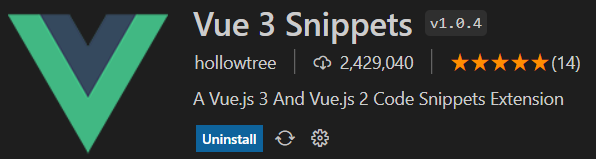

新建`NavBar.vue`组件，使用`vueinit`自动提示命令初始化一个vue页面。scoped的意思是在当前组件中的样式是独立的。

```vue
<template>
    <div>
        
    </div>
</template>
<script>
export default {
    
}
</script>
<style scoped>
    
</style>
```

### Vue安装

1、安装`Nodejs`

https://nodejs.org/en/

2、安装`@vue/cli`

```powershell
npm i -g @vue/cli
```

这里推荐使用早期版本

```powershell
npm i -g @vue/cli@4.5
```

3、启动`vue`自带的图形化项目管理界面

```powershell
vue ui
```

### Vue项目管理

从而打开了vue的控制台


#### 创建Web

使用控制台创建项目，名为web。

注意将初始化git仓库取消


安装插件`vue-router`和`vuex`


安装依赖`jquery`和`bootstrap`


运行serve


此时，项目创建成功


#### 前端

`setup:()`可以认为是整个组件的入口

在vue中实现的所有代码，都是在用户浏览器中执行，而不是在后端执行。也就是用户在打开网页的时候，会将vue代码全部先下载到浏览器，然后浏览器逐个执行每段代码。

## Bootstrap

https://v5.bootcss.com/

快速入门https://v5.bootcss.com/docs/getting-started/introduction/

寻找合适的导航栏

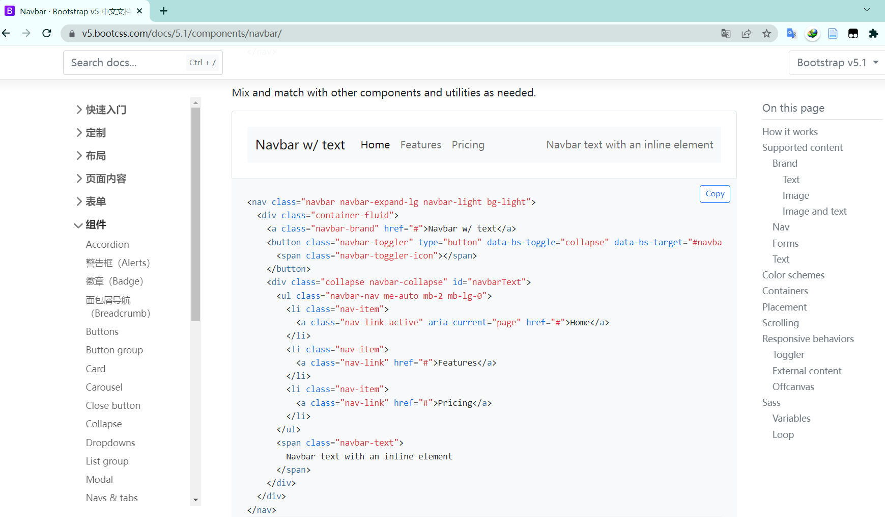

## MySQL

### MySQL服务

（默认开机自动启动，如果想手动操作，可以参考如下命令）

- 关闭：`net stop mysql80`
- 启动：`net start mysql80`

### MySQL常用操作

连接用户名为`root`，密码为`123456`的数据库服务：`mysql -uroot -p123456`

- `show databases;`：列出所有数据库
- `create database kob`;：创建数据库
- `drop database kob;`：删除数据库
- `use kob;`：使用数据库kob
- `show tables;`：列出当前数据库的所有表
- `create table user(id int, username varchar(100))`：创建名称为user的表，表中包含id和username两个属性。
- `drop table user;`：删除表
- `insert into user values(1, 'hong');`：在表中插入数据
- `select * from user;`：查询表中所有数据
- `delete from user where id = 2;`：删除某行数据

### IDEA关联

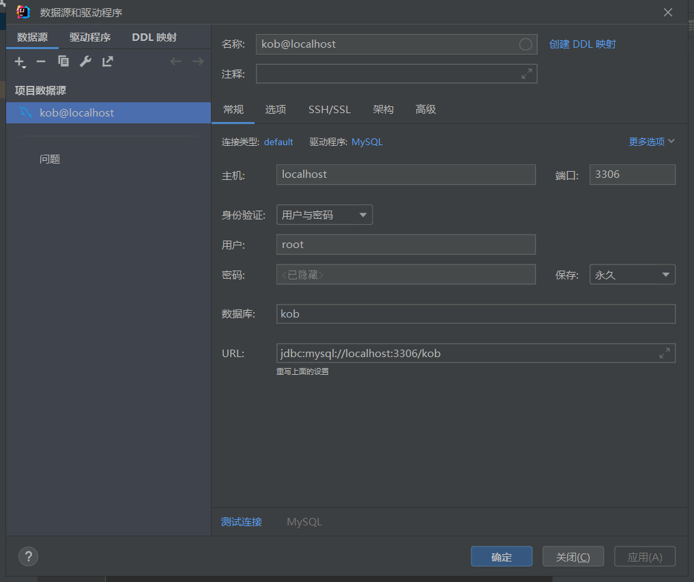

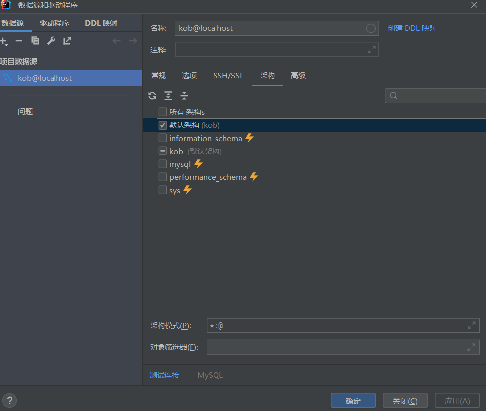

此时MySQL连接成功，并可以在IDEA中通过图形界面修改

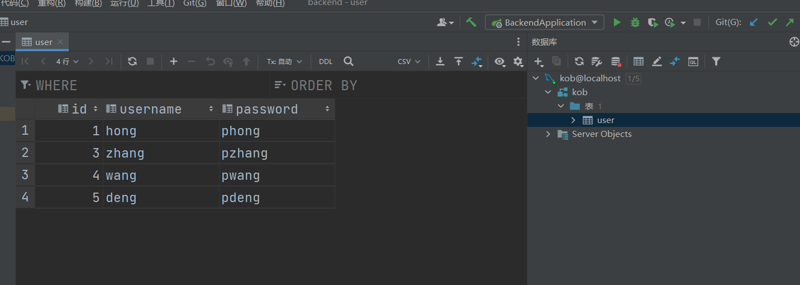

## SpringBoot

### 创建项目后端


> 注意，Thymeleaf是通过前后端不分离的方式写页面，由于我们的最终的项目是前后端分离，因此只是借助这个依赖演示一下前后端不分离的场景。最终是不使用这个依赖的。


Spring后端主要作用是负责实现一些函数，其中每一个url对应一个函数，负责给用户返回一些页面。

一般而言，我们建立一个名为controller的package，用于存储所有的后端函数，在controller中新建pk包。

#### 前后端不分离

在pk包中新建java文件，如果将其作为url对应的函数，需要添加`@Controller`注解

我们期待pk包中的所有文件所对应的url链接，都在pk目录下。


因此，添加注解`@RequestMapping("/pk/")`，也就是添加父目录的意思。

每一个url请求，都要返回一个HTML页面，我们将需要返回的页面在`backend/src/main/resources/templates`中创建。


注意每次修改之后，都需要重启项目。

以上就是前后端不分离的写法，后端向前端返回一个html页面。

#### 前后端分离

而对于前后端分离的写法，后端函数向前端返回的只是一些数据。

需要用到`@RestController`而不是`@Controller`

> `@RestController`用于返回数据
>
> `@Controller`是根据返回的`String`去寻找`template`中的`html`文件

可以返回字符串，可以返回List，也可以返回Map等等。


同样，还可以将Map嵌套到List中


### 添加依赖

在[Maven仓库地址](https://mvnrepository.com/)中搜索相关依赖

然后在`pom.xml`文件中添加依赖：

- `Spring Boot Starter JDBC`

- `Project Lombok`

  自动资源管理、自动生成 getter、setter、equals、hashCode 和 toString 等

- `MySQL Connector/J`

- `mybatis-plus-boot-starter`

- `mybatis-plus-generator`

  [Mybatis-Plus官网](https://baomidou.com/)

- `spring-boot-starter-security`

- `jjwt-api`

以为例`Spring Boot Starter JDBC`为例，复制依赖代码

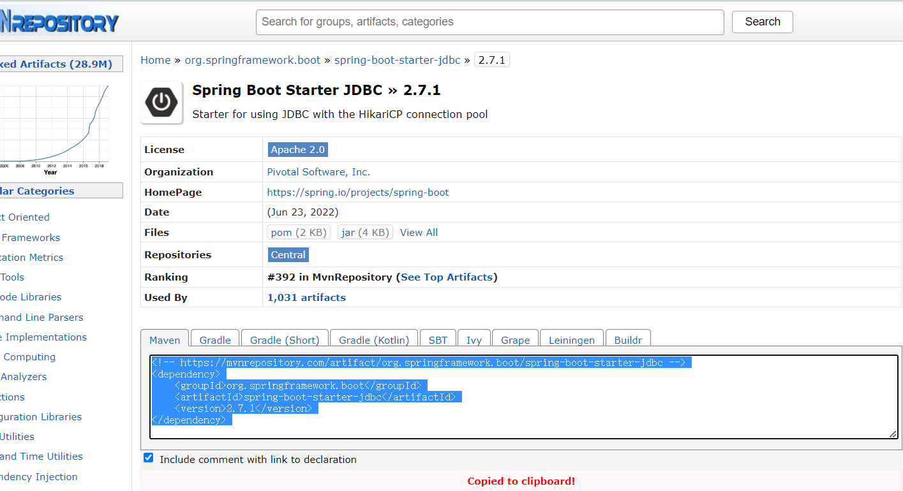

```xml
<!-- https://mvnrepository.com/artifact/org.springframework.boot/spring-boot-starter-jdbc -->
<dependency>
    <groupId>org.springframework.boot</groupId>
    <artifactId>spring-boot-starter-jdbc</artifactId>
    <version>2.7.1</version>
</dependency>
```

复制到`pom.xml`中的`dependencies`模块下：

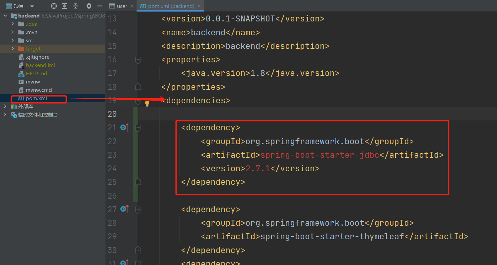

最终添加的`dependency`如下

```xml
<!--Spring Boot Starter JDBC-->
<dependency>
    <groupId>org.springframework.boot</groupId>
    <artifactId>spring-boot-starter-jdbc</artifactId>
    <version>2.7.1</version>
</dependency>
<!--Project Lombok-->
<dependency>
    <groupId>org.projectlombok</groupId>
    <artifactId>lombok</artifactId>
    <version>1.18.24</version>
    <scope>provided</scope>
</dependency>
<!--MySQL Connector/J-->
<dependency>
    <groupId>mysql</groupId>
    <artifactId>mysql-connector-java</artifactId>
    <version>8.0.29</version>
</dependency>
<!--mybatis-plus-boot-starter-->
<dependency>
    <groupId>com.baomidou</groupId>
    <artifactId>mybatis-plus-boot-starter</artifactId>
    <version>3.5.2</version>
</dependency>
<!--mybatis-plus-generator-->
<dependency>
    <groupId>com.baomidou</groupId>
    <artifactId>mybatis-plus-generator</artifactId>
    <version>3.5.3</version>
</dependency>
```

重新加载所有`maven`项目

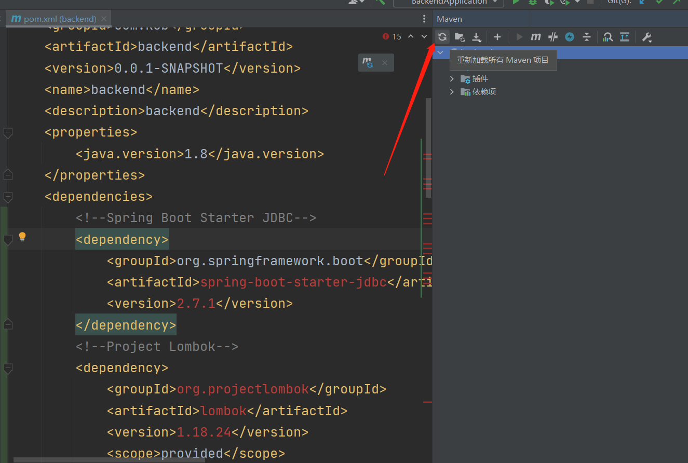

加载完成之后，就能看到依赖项

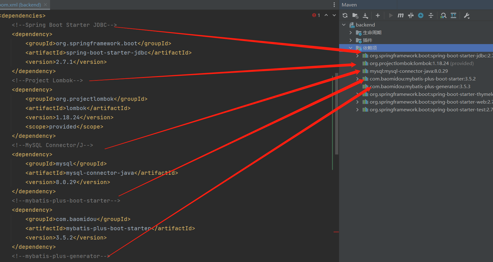

### 数据库配置

在`application.properties`中添加数据库配置：

```
spring.datasource.username=root
spring.datasource.password=123456
spring.datasource.url=jdbc:mysql://localhost:3306/kob?serverTimezone=Asia/Shanghai&useUnicode=true&characterEncoding=utf-8
spring.datasource.driver-class-name=com.mysql.cj.jdbc.Driver
```

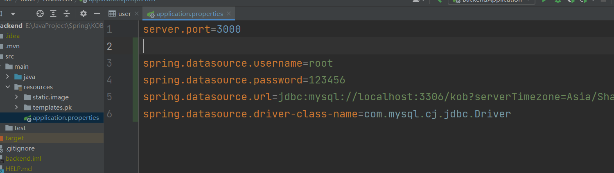

此时运行项目即可

### SpringBoot中的常用模块

- `pojo`层：将数据库中的表对应成`Java`中的`Class`

- `mapper`层（也叫`Dao`层）：将`pojo`层的`class`中的操作（CRUD），映射成`sql`语句

  Create => insert

  Retrieve=> select

- `service`层：写具体的业务逻辑，组合使用`mapper`中的操作

- `controller`层：负责请求转发，接受前端页面过来的参数，传给相应`Service`处理，接到返回值，再传给页面

依次实现这些模块

#### pojo层

首先创建`com/kob/backend/pojo`包，然后在其中创建`User.java`

负责实现与`user`表想对应的`User`类

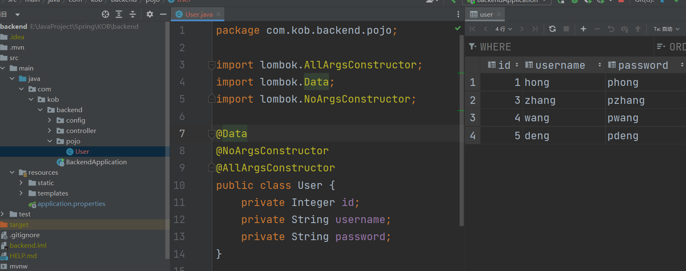

这里的关键是三个注解

从编译后的`class`文件中，也能证明这一点。

添加注解之前：

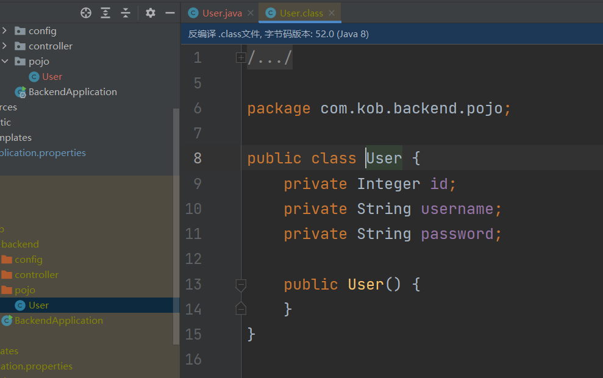

添加注解之后

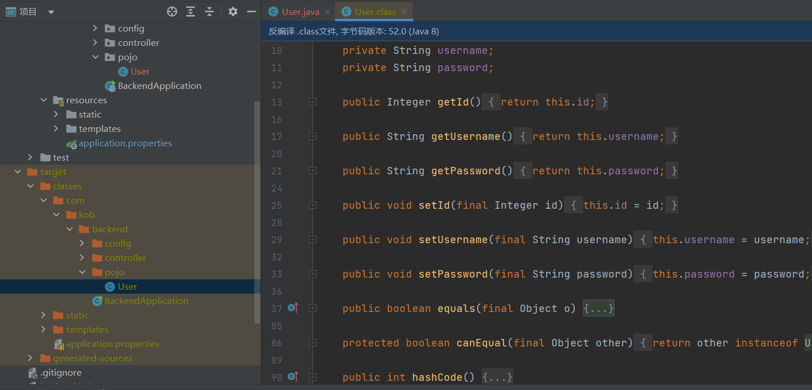

#### mapper层

首先创建`com/kob/backend/mapper`包，然后在其中创建`UserMapper.java`

添加`@Mapper`注解并且继承`mybatisplus`中的`BaseMapper`，传入`<User>`

目的是将`pojo`层的`User`中的操作（CRUD），映射成`sql`语句

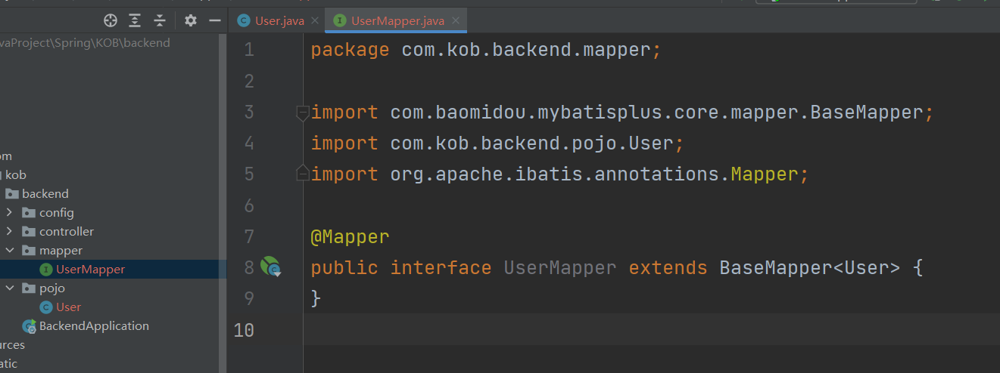

#### controller层

为方便调试，在当前阶段，先讲`service`与`controller`写在一块（后期具体业务需要分开，`controller`调用`sevice`中的接口）

创建`com/kob/backend/controller`包

然后针对`User`表创建`/user/UserController.java`

添加`@RestController`注解

```java
@RestController
```

在这里我们可以实现与`User`表相关的业务逻辑（正常应该在`service`层 这里为了方便调试 暂时写在一块了）

`@RequestMapping `将所有请求类型全部接收过来

- 如果只处理`post`类型的请求`@PostMapping`
- 如果只处理`get`类型的请求`@GetMapping`

1）实现查询当前所有用户

在`controller`中如何调用数据库的接口

 首先引入刚刚定义的UserMapper接口

```java
@Autowired
UserMapper userMapper;
```

UserMapper接口由mybatisplus来实现

```java
@Mapper
public interface UserMapper extends BaseMapper<User> {
}
```

继承了mybatisplus中的BaseMapper

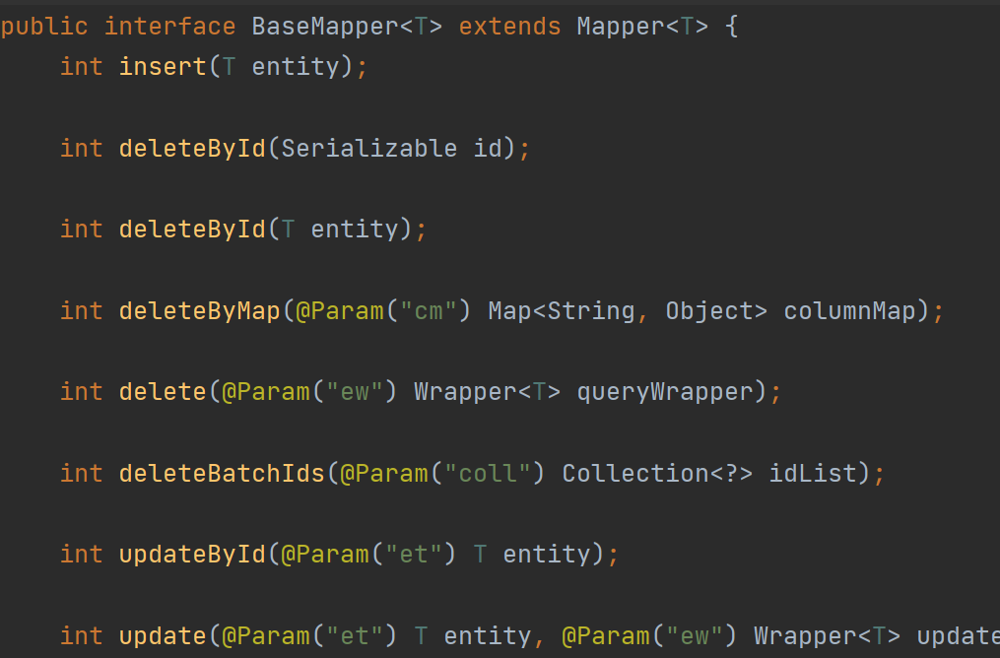

可以通过[Mybatis-Plus官网](https://baomidou.com/)来查看所有API的具体用法

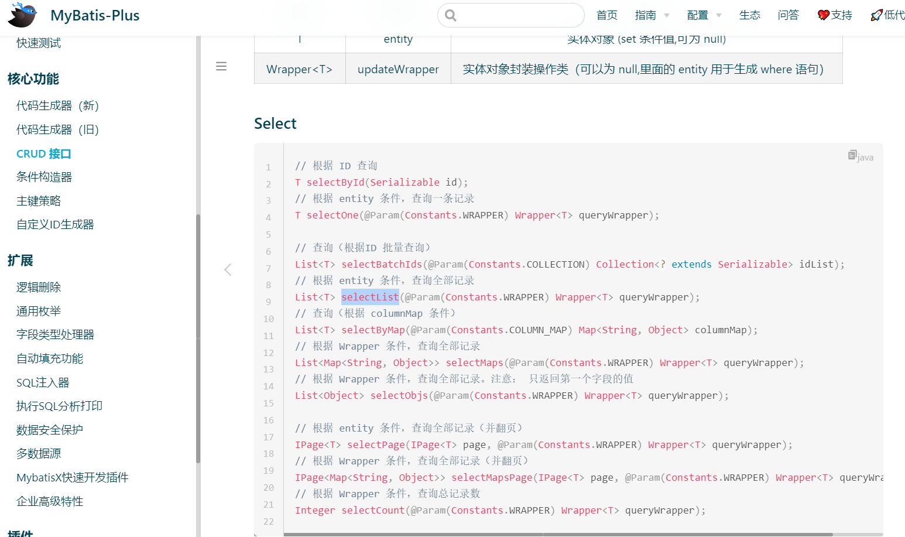

如果我们希望查询所有用户，就要借助`selectList`这个api

```java
@RestController
public class UserController {
    @Autowired
    UserMapper userMapper;

    @GetMapping("/user/all/")
    public List<User> getAll(){
        return userMapper.selectList(null);
    }
}
```

与实际数据表中结果一致

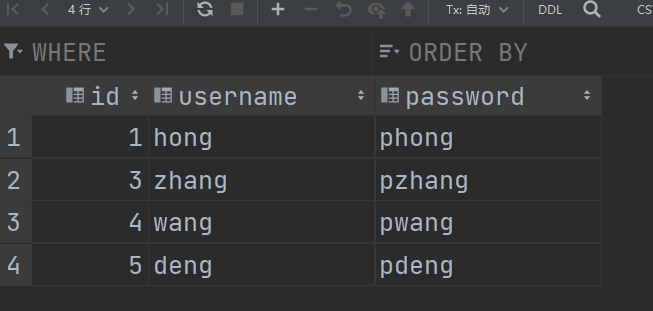

2）指定ID查询用户

使用`selectById`api根据ID来查询用户

```java
@GetMapping("/user/{userId}")
public User getUser(@PathVariable int userId){
    return userMapper.selectById(userId);
}
```

同时也可以借助`Mybatis-Plus`中的条件构造器，来构造一些自定义的条件，通过对条件进行筛选的方式来过滤出结果。

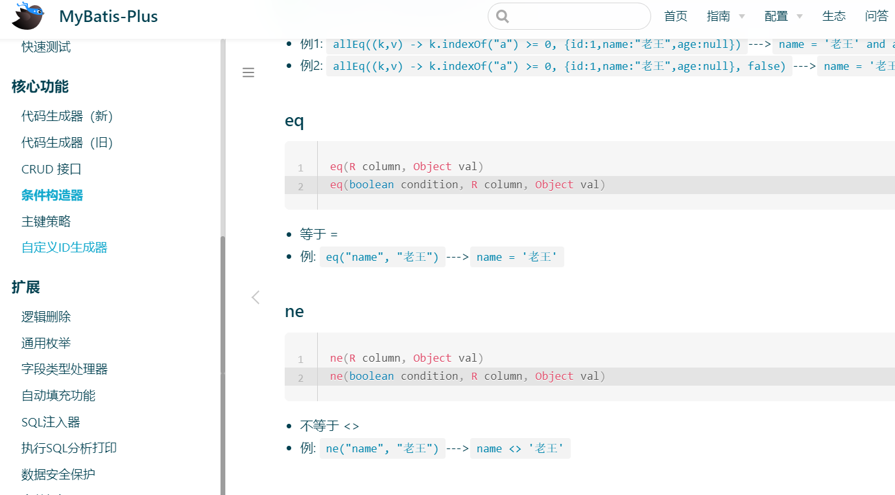

```java
@GetMapping("/user/{userId}")
public User getUser(@PathVariable int userId){
    QueryWrapper<User> queryWrapper = new QueryWrapper<>();
    queryWrapper.eq("id", userId);//构造条件
    return userMapper.selectOne(queryWrapper);//过滤
}
```

结果与`selectById`一致。

这里代码中的返回值中的`User`就是所得到的符合条件`pojo`中`User`类的对象。

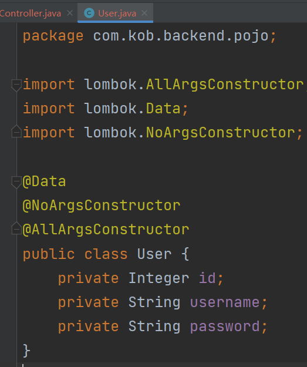

实际上就是返回数据表中的一行数据。

3）区间查询

同样可以通过`ge`和`le`来进行区间查询

```java
@GetMapping("/user/{userId}/to/{userId2}")
public List<User> getUser(@PathVariable int userId, @PathVariable int userId2){
    QueryWrapper<User> queryWrapper = new QueryWrapper<>();
    queryWrapper.ge("id", userId).le("id",userId2);//构造条件
    return userMapper.selectList(queryWrapper);//过滤
}
```

> 可以无限追加条件，通过`.condition`的方式

4）插入数据

```java
@GetMapping("/user/add/{userId}/{username}/{password}")
public String addUser (
        @PathVariable int userId,
        @PathVariable String username,
        @PathVariable String password){

    User user = new User(userId, username, password);
    userMapper.insert(user);
    return "Add User Successfully";
}
```

5）删除记录

```java
@GetMapping("/user/delete/{userId}")
public String deleteUser(@PathVariable int userId){
    userMapper.deleteById(userId);
    return "Delete User Successfully";
}
```

## mdn

https://developer.mozilla.org/zh-CN/

## Canvas API

https://developer.mozilla.org/zh-CN/docs/Web/API/Canvas_API

## 配置git环境

1. 安装Git Bash（使用Mac和Linux的可以跳过这一步）：https://gitforwindows.org/

   > 全部默认即可

2. 输入`cd`回车进入家目录，执行命令`ssh-keygen`生成秘钥

   > 我们使用Gitee(Github、Acgit)的时候，通信的方式通过ssh
   >
   > 由于Gitee不支持用户名密码，因此需要借助秘钥来操作上

   

3. 然后进入`.ssh`文件夹，`id_rsa`和`id_rsa.pub`分别代表私钥和公钥文件，将公钥取出。

   

4. 将id_rsa.pub的内容复制到Gitee上

> 使用SSH公钥可以让你在你的电脑和 Gitee 通讯的时候使用安全连接（Git的Remote要使用SSH地址）

### 提交git

github git init 初始化

git add . 上传到预空间

git commit -m "第一次上传"

 git push -u origin main
